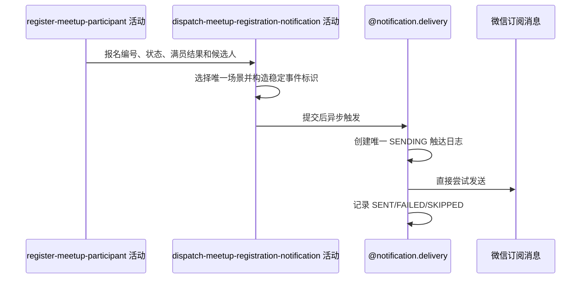

## 概要

按报名结果在事务提交后异步发送报名成功、组团成功或待审批通知。

## 时序图

## 触发条件

报名及直接加入时的群聊成员变更即将提交后执行；每次成功报名恰好选择一个通知场景。

## 活动契约

入参包含约球编号、报名编号、报名状态、是否满员、报名人、创建者、有效参与者和语义化通知内容。成功只表示异步触达已安排，不表示渠道送达。

## 领域依赖

### @notification.delivery

- 输入：稳定事件标识、`MEETUP`、约球编号、选定场景、候选接收人、语义化内容和可选成员过滤器
- 输出：每个接收人与渠道最多一条触达日志；成功、失败或预期跳过都不影响报名

## 详细流程

1. `JOINED` 且满员选择 `TEAM_SUCCESS`，事件标识使用本次报名编号，候选是全部有效参与者。
2. `JOINED` 且未满员选择 `JOIN_SUCCESS`，事件标识使用报名编号，候选只有报名人。
3. `PENDING` 选择 `PENDING_APPROVAL`，事件标识使用报名编号，候选只有创建者。
4. 核心事务提交后进入通知线程池；发送前复核约球成员资格，明确退出者不建日志，复核异常 fail-open。
5. 成功建立唯一 `SENDING` 日志后直接调用微信。`43101` 或缺少 openid 记 `SKIPPED`，渠道错误记 `FAILED`，成功记 `SENT`。

## 边界情况

- 满员时不再发报名成功；待审批时不向报名人发消息。
- 同一报名事件重复触发时，触达唯一键阻止同接收人、同渠道重发。
- 未订阅、无接收身份、渠道失败或结果回写失败均不改变报名。
- 当前无持久化任务重试；进程中断可能留下 `SENDING`。
