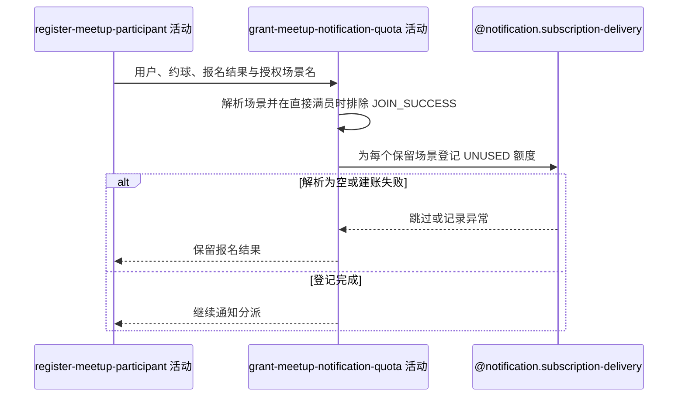

## 概要

按报名人本次授权的有效场景尽力登记订阅通知额度。

## 时序图

## 触发条件

上游报名已建立且直接加入时的群聊写入已成功后执行；待审批报名同样执行。空授权列表可直接完成。

## 活动契约

### 入参

| 字段 | 类型 | 必填 | 约束 |
|---|---|---|---|
| `userId` | 字符串 | 是 | 本次报名用户编号 |
| `meetupId` | 字符串 | 是 | 额度关联的约球编号 |
| `acceptedNoticeScenes` | 字符串列表 | 否 | 可解析的 `NoticeScene` 名称；非法项忽略，重复项保留 |
| `registrationStatus` | 枚举 | 是 | `JOINED` 或 `PENDING` |
| `teamFormed` | 布尔值 | 是 | 仅直接加入且更新后满员时为 true |

### 成功返回

无业务数据；成功只表示尽力登记过程已结束，不保证额度实际落库。

## 异常分支

无。未知场景被忽略；额度构造或批量保存异常被记录并吞掉，不改变报名结果。

## 领域依赖

### @notification.subscription-delivery

- 输入：报名用户、业务类型 `MEETUP`、约球编号、解析后的授权场景，以及为每项授权建立一次可用额度的意图
- 输出：为每个保留场景建立独立 `UNUSED` 流水；输入为空或保存异常时返回跳过/失败结论且不影响报名

## 业务动作

A1 把客户端场景名解析为可识别通知场景
A2 直接满员时排除报名成功场景
A3 为每个保留场景建立独立可用额度
A4 吞掉建账异常并继续主流程

## 详细流程

1. `A1` 对列表逐项按枚举名解析，未知值转为空并过滤；空列表不调用持久化。解析不限制场景必须属于约球，也不去重。
2. `A2` 仅当报名状态为 `JOINED` 且更新后已满员时，从结果中排除全部 `JOIN_SUCCESS`，避免紧接着的组团成功通知与报名成功重复。
3. `A3` 以 `userId/MEETUP/meetupId/scene` 为每个剩余元素生成雪花业务编号，冗余模板编号并置为 `UNUSED`，然后批量保存。
4. 重复场景会形成多条额度；其他业务方向的已知场景也可被登记为 `MEETUP` 额度，当前没有白名单约束。
5. 建账在外层事务尚未提交时调用，但服务捕获所有异常；失败只记日志，不能使报名或群聊回滚。成功流水随外层事务提交。
6. 本活动不检查微信是否真正授权，也不返回已建额度数量。

## 边界情况

- `acceptedNoticeScenes=null`、空列表或全是非法值时不写流水。
- 直接满员时只排除 `JOIN_SUCCESS`，不会自动补充 `TEAM_SUCCESS`。
- 重复授权名会生成重复额度，供后续多次通知逐条消费。
- 批量中任一数据库异常可能使整批未建账，但接口仍返回报名成功。

## 实现提示

客户端场景声明当前被直接信任；如需收紧，应在通知领域按业务类型维护白名单并定义重复授权策略。本轮保持尽力型语义。
