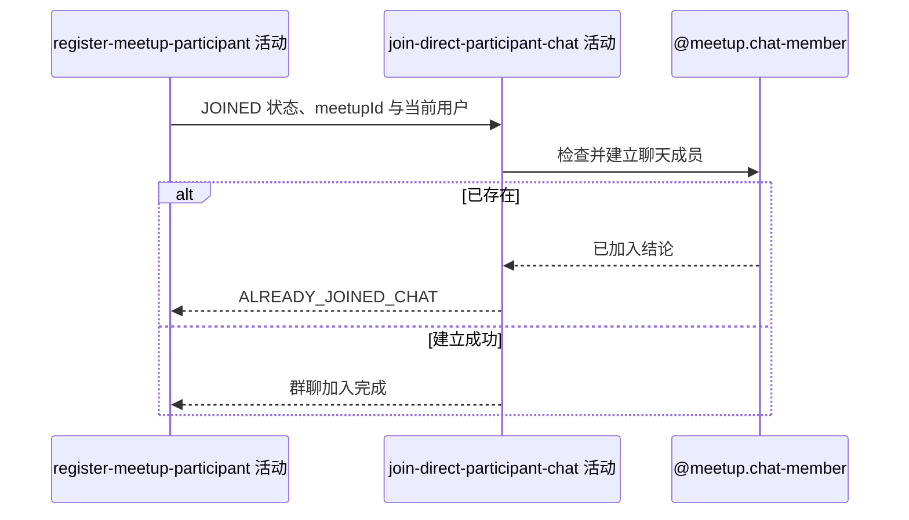

## 概要

为直接加入的报名人建立未读数为零的群聊成员关系。

## 时序图

## 触发条件

同服务上游已新增状态为 `JOINED` 的直接报名后、外层事务提交前执行；`PENDING` 报名跳过本活动。

## 活动契约

### 入参

| 字段 | 类型 | 必填 | 约束 |
|---|---|---|---|
| `meetupId` | 字符串 | 是 | 已建立直接报名的约球编号 |
| `userId` | 字符串 | 是 | 当前报名用户编号 |
| `registrationStatus` | 枚举 | 是 | 仅 `JOINED` 执行；`PENDING` 跳过 |

### 成功返回

无业务数据；执行时已建立初始聊天成员关系，跳过时不产生关系。

## 异常分支

| 错误标识 | 触发条件 | 来源 |
|---|---|---|
| `ALREADY_JOINED_CHAT` | 相同约球和用户已有聊天成员记录 | join-meetup 流程 `ALREADY_JOINED_CHAT` 一行 |
| `SYSTEM_ERROR` | 聊天成员读取、唯一冲突或保存失败 | join-meetup 流程 `SYSTEM_ERROR` 一行 |

## 领域依赖

### @meetup.chat-member

- 输入：约球编号、当前用户编号与建立新聊天成员的意图
- 输出：不存在相同关系时建立雪花编号、初始未读 0、当前加入时间的成员；已存在或保存失败时返回相应结论

## 业务动作

A1 按报名状态决定执行或跳过
A2 检查约球与用户的聊天成员关系是否存在
A3 建立初始未读数为零的新聊天成员
A4 确认群聊加入完成

## 详细流程

1. `A1` 仅当上游报名状态为 `JOINED` 时继续；审批模式产生的 `PENDING` 报名不加入群聊。
2. `A2` 按 `refId+userId` 检查；存在时拒绝，不按刚建立的报名修复或复用成员。
3. `A3` 生成雪花业务编号，保存 `unreadCount=0`、`joinedAt=当前时间`，已读消息编号与时间为空。
4. 不读取历史消息，因此加入前已有消息不会进入初始未读数。
5. 已退出聊天的成员记录已删除时可重新建立；并发建立由唯一键裁决，不按幂等成功处理。
6. `A4` 仍在报名事务内，失败会回滚上游报名、人数和本活动写入；成功后才进入尽力型额度登记。

## 边界情况

- 先有聊天成员但无活跃报名时，本次直接报名整体失败。
- 待审批报名不会建立成员，即使请求人过去存在已删除的聊天关系。
- 并发请求可能一个成功、另一个因成员唯一约束失败。
- 成功加入不推进到任何历史消息。

## 实现提示

成员唯一性继续由 `ref_id+user_id` 保证；不要把 `PENDING` 报名或历史消息引入当前加入语义。
