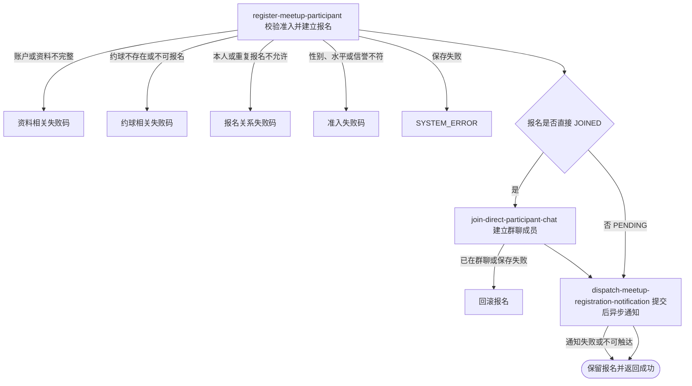

## 概要

为符合准入条件的用户建立直接加入或待审批报名。

## 触发

已登录用户从约球详情或分享入口申请加入时发起，调用方是用户端。一次请求处理当前用户对一个约球的报名；没有幂等键，重复到达依靠活动报名检查拒绝，但并发请求没有用户约球唯一性或名额预占保护。

## 接口契约

### 请求参数

| 字段 | 类型 | 必填 | 约束 |
|---|---|---|---|
| `meetupId` | 字符串 | 是 | 不可为空白，目标约球编号 |
| `autoWithdrawAt` | 日期时间 | 否 | 原样保存；当前不校验时间范围或加入模式 |
| `shareUserId` | 字符串 | 否 | 当前仅记录日志，不保存分享归因 |

### 成功响应

无业务数据；成功可能表示报名已为 `JOINED`，也可能表示报名处于 `PENDING`。接口不交付报名编号、终态、当前人数、群聊或通知结果。

## 业务活动

- register-meetup-participant  校验用户资料和约球准入，按加入模式建立报名并重算当前人数
- join-direct-participant-chat  对直接加入报名建立本人群聊成员关系
- dispatch-meetup-registration-notification  在提交后按报名事件异步发送报名、组团或待审批通知，以触达日志去重

## 流程图

## 详细流程

1. 识别当前登录用户并读取账户、基础资料与网球档案；要求昵称头像不再是默认值，且档案处于正常或核查期。
2. 可选分享用户编号只记录日志，不进入归因、权限或报名关系。
3. 读取约球及全部报名，以当前时间判断实际状态；确认未满员、未关闭、未进行或结束、开始时间未到，本人不是发布者且没有待审核或有效报名。草稿状态没有被单独拒绝。
4. 核对性别、信誉分和 NTRP：缺失性别、NTRP 或信誉分时当前实现放行；未公开性别在限男性或限女性时拒绝。
5. 建立报名并原样保存可选自动撤回时间，不校验其先后范围，也没有本服务配套的自动撤回执行入口；直接加入模式置为 `JOINED`，审批模式置为 `PENDING`。
6. 创建报名对象时由构造器生成雪花业务报名编号，整体保存约球与报名并重算当前人数；接口不返回编号或本次终态。
7. 直接加入时建立本人群聊成员关系；已存在群聊成员或保存失败时回滚本次报名、人数和群聊变更。待审批不加入群聊、不占已加入人数。
8. 事务提交后异步通知：直接加入未满员时以报名编号构造事件并通知本人报名成功；满员时也以本次报名编号构造组团事件，只向全部有效参与者通知组团成功；待审批时以报名编号构造审批提醒事件。
9. 每个事件按接收人和渠道建立唯一触达日志后直接调用渠道；未订阅记为 `SKIPPED`，其他失败记为 `FAILED`。
10. 返回报名成功；通知失败或不可触达不撤销报名。

## 异常分支

| 对外失败码 | 触发条件 | 由哪个活动报出 | 补偿动作或超时处理 | 对外提示 |
|---|---|---|---|---|
| 请求校验失败 | `meetupId` 为空白 | 流程 | 不建立报名 | 约球ID不能为空 |
| `TOKEN_INVALID` | 当前身份没有账户 | register-meetup-participant | 不建立报名 | 登录凭证无效，请重新登录 |
| `REGISTRATION_INCOMPLETE` / `USER_INCOMPLETE` / `ONBOARDING_INCOMPLETE` | 基础资料和网球档案未按要求完成 | register-meetup-participant | 不建立报名 | 提示完善个人信息或网球档案 |
| `MEETUP_NOT_FOUND` | 目标约球不存在 | register-meetup-participant | 不建立报名 | 约球不存在 |
| `MEETUP_FULL` | 有效人数已达到人数上限 | register-meetup-participant | 不建立报名 | 约球已满员 |
| `MEETUP_CLOSED` / `MEETUP_EXPIRED` / `MEETUP_ONGOING` | 约球已关闭、已结束、已开始或正在进行 | register-meetup-participant | 不建立报名 | 约球已关闭，或已开始/进行/结束无法报名 |
| `CANNOT_JOIN_OWN` | 当前用户是发布者 | register-meetup-participant | 不建立报名 | 不能报名自己发布的约球 |
| `ALREADY_JOINED` | 已有 `PENDING` 或有效报名 | register-meetup-participant | 不新增报名 | 你已报名该约球 |
| `GENDER_NOT_MATCH` / `LEVEL_NOT_MATCH` / `LOW_REPUTATION_BANNED` | 性别、NTRP 或信誉分不符合要求 | register-meetup-participant | 不建立报名 | 对应准入不符合提示 |
| `ALREADY_JOINED_CHAT` | 直接加入时本人已有群聊成员记录 | join-direct-participant-chat | 整体事务回滚报名和当前人数 | 你已加入该聊天 |
| `SYSTEM_ERROR` | 报名、约球、群聊成员读写或事务提交失败 | register-meetup-participant / join-direct-participant-chat | 整体事务回滚本次报名、人数和群聊变更 | 系统异常，请稍后重试 |

草稿状态当前不被拒绝。`REJECTED`、`WITHDRAWN`、`QUIT` 历史不阻止新报名；并发请求可能超员或产生重复活动报名。提交后通知的失败或不可触达只写触达日志，不改变报名；待审批不占名额，也不加入群聊。

## 技术线索

- HTTP 接口：`POST /meetup/registration/join`
- 报名状态：`JOINED`、`PENDING`；自动撤回时间保存到 `expiresAt`
- 群聊成员：仅直接加入时建立
- 配置：`MEETUP_JOIN_MIN_REPUTATION_SCORE`
- 通知场景：`JOIN_SUCCESS`、`TEAM_SUCCESS`、`PENDING_APPROVAL`
- `shareUserId` 当前只写日志
