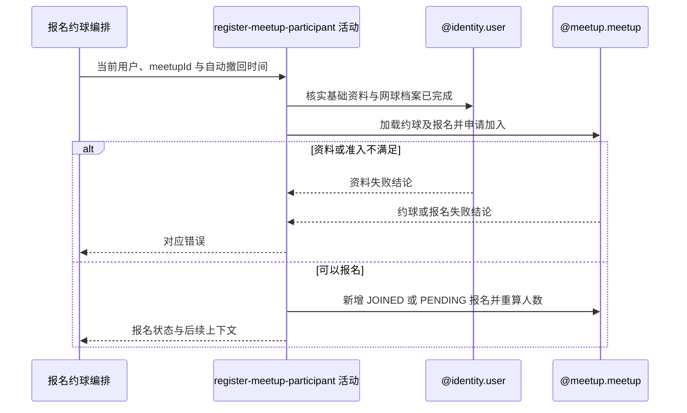

## 概要

校验当前用户资料与约球准入，建立直接加入或待审批报名并重算人数。

## 时序图

## 触发条件

已登录用户提交非空约球编号后执行；流程已完成请求字段反序列化，但未校验自动撤回时间或分享归因。

## 活动契约

### 入参

| 字段 | 类型 | 必填 | 约束 |
|---|---|---|---|
| `meetupId` | 字符串 | 是 | 非空白，目标约球编号 |
| `userId` | 字符串 | 是 | 当前登录用户编号 |
| `autoWithdrawAt` | 日期时间 | 否 | 原样进入报名 `expiresAt`，不校验时序 |
| `shareUserId` | 字符串 | 否 | 只用于日志，不参与本活动 |

### 成功返回

| 字段 | 类型 | 必填 | 说明 |
|---|---|---|---|
| `registrationContext` | 报名上下文 | 是 | 报名状态、用户和约球编号、更新后有效参与者、人数上限、是否满员及通知摘要；不对外返回报名编号 |

## 异常分支

| 错误标识 | 触发条件 | 来源 |
|---|---|---|
| `TOKEN_INVALID` | 当前用户对应账户不存在 | join-meetup 流程 `TOKEN_INVALID` 一行 |
| `REGISTRATION_INCOMPLETE` / `USER_INCOMPLETE` / `ONBOARDING_INCOMPLETE` | 基础资料和网球档案未完成 | join-meetup 流程对应资料错误一行 |
| `MEETUP_NOT_FOUND` | 目标约球不存在 | join-meetup 流程 `MEETUP_NOT_FOUND` 一行 |
| `MEETUP_FULL` | 加载时有效人数已达到上限 | join-meetup 流程 `MEETUP_FULL` 一行 |
| `MEETUP_CLOSED` / `MEETUP_EXPIRED` / `MEETUP_ONGOING` | 约球已关闭、开始或结束 | join-meetup 流程对应约球状态错误一行 |
| `CANNOT_JOIN_OWN` | 当前用户是约球创建者 | join-meetup 流程 `CANNOT_JOIN_OWN` 一行 |
| `ALREADY_JOINED` | 已有待审批或有效报名 | join-meetup 流程 `ALREADY_JOINED` 一行 |
| `GENDER_NOT_MATCH` / `LEVEL_NOT_MATCH` / `LOW_REPUTATION_BANNED` | 用户不符合性别、水平或信誉准入 | join-meetup 流程对应准入错误一行 |
| `SYSTEM_ERROR` | 用户资料、约球或报名读写及事务提交失败 | join-meetup 流程 `SYSTEM_ERROR` 一行 |

## 领域依赖

### @identity.user

- 输入：当前用户编号与确认基础资料、网球档案完整的意图
- 输出：返回包含用户、性别、信誉和 NTRP 的档案；账户不存在或资料未完成时返回对应失败结论

### @meetup.meetup

- 输入：约球编号、用户档案、自动撤回时间，以及校验容量、状态、报名关系和准入规则的意图
- 输出：新增 `JOINED` 或 `PENDING` 报名，按有效参与者重算人数并返回后续上下文；不符合规则或保存失败时返回相应结论

## 业务动作

A1 核实当前用户基础资料与网球档案已完成
A2 加载约球和全部报名并检查状态、容量与既有关系
A3 检查性别、信誉分和 NTRP 准入
A4 按加入模式新建报名并保存自动撤回时间
A5 整体保存聚合、重算人数并返回后续上下文

## 详细流程

1. `A1` 要求账户存在，昵称和头像不再是系统默认值，网球档案状态不是 `NONE/TBC`；核查期档案仍视为已完成。
2. `A2` 以当前时间懒计算状态，拒绝已满、`CLOSED/FINISHED/ONGOING`、开始时间已过、本人创建以及已有 `PENDING/JOINED/REVIEWED/SKIPPED` 报名的情况；`DRAFT` 没有被单独拒绝。
3. `A3` 按约球配置检查性别、最低信誉和 NTRP 范围；用户缺少性别、信誉或 NTRP 时当前规则放行，未公开性别不满足限男性或限女性。
4. `A4` 构造新报名并生成雪花业务编号，把 `autoWithdrawAt` 原样保存到 `expiresAt`；直接加入模式置为 `JOINED`，审批模式置为 `PENDING`。
5. `A5` 以报名业务编号 upsert 聚合内报名，并把 `currentPlayers` 重算为创建者加 `JOINED/REVIEWED/SKIPPED` 数量；`PENDING` 不占人数。
6. `shareUserId` 只由应用层记录日志，不进入报名数据、权限或归因。成功响应不返回报名编号和状态。
7. 本活动与直接加入时的群聊成员写入处在同一外层事务；下游群聊失败会回滚报名和人数。

## 边界情况

- `REJECTED/WITHDRAWN/QUIT` 历史报名不阻止再次报名，旧记录继续保留。
- `autoWithdrawAt` 可为空、在过去或晚于活动开始；当前只保存，没有本服务内自动撤回执行入口。
- 串行重复报名会被拒绝；没有请求幂等键，也没有 meetup+user 唯一约束，并发可能重复报名或超员。
- 草稿约球可能报名；性别、信誉或 NTRP 数据缺失时不会因该项被拒绝。

## 实现提示

若治理并发，应在聚合存储层同时约束名额与约球用户关系；若启用自动撤回，需补充明确时序规则和执行机制。本轮保持现有行为。
