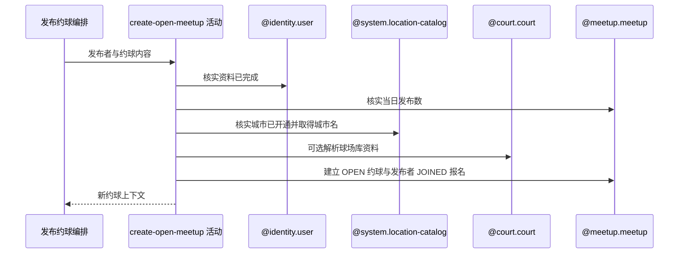

## 概要

校验发布资格与内容，建立开放约球及发布者已加入报名。

## 时序图

## 触发条件

已登录用户提交通过注解必填、长度、人数与坐标范围校验的普通约球发布请求后执行。

## 活动契约

### 入参

| 字段 | 类型 | 必填 | 约束 |
|---|---|---|---|
| `publisherId` | 字符串 | 是 | 当前登录用户编号 |
| `title` | 字符串 | 否 | 最多 128 字符；空白时生成默认标题 |
| `matchType` / `maxPlayers` | 枚举 / 整数 | 是 | 单打、双打或拉球；2 至 16 人 |
| `startTime` / `duration` | 日期时间 / 小数 | 是 | 不早于校验时刻；持续 0.5 至 3.0 小时的半小时档 |
| `court` | 场地参数 | 是 | 地址和坐标必填；TEXT/MAP 可附球场编号 |
| `cityCode` | 字符串 | 是 | 必须属于已开通城市 |
| `level` | 水平限制 | 是 | 模式与 1.5 至 7.0、0.5 步长边界组合有效 |
| `genderLimit` / `joinMode` | 枚举 | 是 | 性别限制和直接/审批加入方式 |
| `costItems` / `courtIndex` | 列表 / 字符串 | 否 | 原样保存，不做内容校验 |

### 成功返回

| 字段 | 类型 | 必填 | 说明 |
|---|---|---|---|
| `meetupContext` | 新约球上下文 | 是 | 新约球编号、发布者、发布者报名、场地和人数等后续步骤所需信息；接口不直接交付 |

## 异常分支

| 错误标识 | 触发条件 | 来源 |
|---|---|---|
| `TOKEN_INVALID` | 当前用户账户不存在 | publish-meetup 流程 `TOKEN_INVALID` 一行 |
| `REGISTRATION_INCOMPLETE` / `USER_INCOMPLETE` / `ONBOARDING_INCOMPLETE` | 基础资料或网球档案未完成 | publish-meetup 流程对应资料错误一行 |
| `PUBLISH_LIMIT_EXCEEDED` | 当日计数达到配置上限 | publish-meetup 流程 `PUBLISH_LIMIT_EXCEEDED` 一行 |
| `CITY_NOT_OPENED` | 城市编码未开通 | publish-meetup 流程 `CITY_NOT_OPENED` 一行 |
| `PARAM_ERROR` | 开始时间、持续时长或水平模式组合不合法 | publish-meetup 流程 `PARAM_ERROR` 一行 |
| `SYSTEM_ERROR` | 配置、城市名录、球场、约球或报名读写及事务提交失败 | publish-meetup 流程 `SYSTEM_ERROR` 一行 |

## 领域依赖

### @identity.user

- 输入：发布者编号与核实基础资料、网球档案完整的意图
- 输出：账户存在且资料完成时允许发布，否则返回对应失败结论

### @system.location-catalog

- 输入：城市编码与核实已开通、解析城市名称的意图
- 输出：返回开通城市名称；未开通或名录不一致时返回失败结论

### @court.court

- 输入：TEXT/MAP 模式下的非空球场编号与读取当前球场资料的意图
- 输出：命中时返回名称、地址、坐标和区县；未命中时允许调用方退回请求场地

### @meetup.meetup

- 输入：发布者、校验后的发布内容、可选球场资料与建立首位报名的意图
- 输出：生成并保存 `OPEN` 普通约球和发布者 `JOINED` 报名，重算当前人数为一；达到上限或保存失败时返回相应结论

## 业务动作

A1 核实发布者资料和当日发布次数
A2 校验城市、时间、时长和水平限制
A3 解析球场资料并确定最终地点
A4 生成约球内容、标题、结束时间与业务编号
A5 建立发布者 JOINED 报名并整体保存

## 详细流程

1. `A1` 要求账户存在、昵称头像非默认且网球档案不是 `NONE/TBC`；核查期可发布。每日上限读取 `anti_abuse.publish_per_day_limit`，默认 50，只统计当天存储状态 `OPEN` 和小写 `full`。
2. `A2` 要求城市已开通、开始时间不早于活动执行时刻，持续时长只接受 `0.5/1.0/1.5/2.0/2.5/3.0`。
3. 水平边界须在 1.5 至 7.0 且为 0.5 步长；`RANGE` 要求两端且最小不大于最大，`EXACT` 要求最小值并在上界缺失时补成相同值，`ABOVE/BELOW` 分别要求最小/最大值。
4. `A3` 仅在 `TEXT/MAP` 且球场编号非空时查询；命中后以球场库的名称、地址、坐标和非空区县为准，未命中、FREE 或无编号则使用请求字段并从最终地址提取区县。`districtCode` 不保存。
5. `A4` 计算结束时间，生成雪花约球编号，写普通约球、发布者、城市名和 `OPEN`。标题空白时按星期、活动类型、性别限制和是否审批拼接。
6. `A5` 另生成发布者报名编号，状态为 `JOINED`，与约球整体 upsert；`currentPlayers` 按有效报名重算为 1。
7. 费用项和场地索引原样映射，不检查名称、金额、数量、重复或与人数的关系；接口不返回新约球编号。
8. 命中球场库时 MapStruct 还会复制球场同名审计字段，随后只覆盖约球编号和城市名，因而新约球可能沿用球场创建与更新时间。

## 边界情况

- 无请求幂等键或内容去重；每日上限允许时重复请求会创建不同约球。
- 开始时间等于校验时刻理论上可通过，但执行时钟推进可能使边界请求失败。
- 球场编号未命中不阻断，且请求城市不与命中球场归属做一致性校验。
- 状态计数大小写不一致，只计 `OPEN` 与小写 `full`，其他存储值不占发布额度。

## 实现提示

本轮保留现有降级和计数规则；后续治理应统一状态枚举存储、显式映射审计字段，并决定球场未命中与跨城市时是否拒绝。
