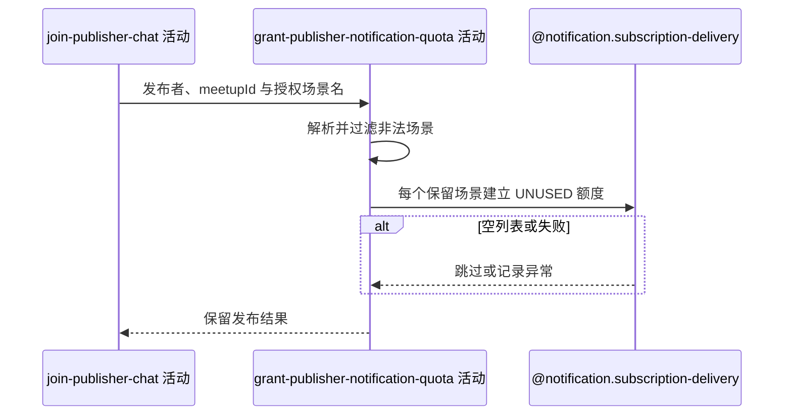

## 概要

按发布者本次可识别授权场景尽力登记通知额度。

## 时序图

## 触发条件

约球、发布者报名和群聊成员已在外层事务内建立后执行；空授权列表可直接完成。

## 活动契约

### 入参

| 字段 | 类型 | 必填 | 约束 |
|---|---|---|---|
| `publisherId` | 字符串 | 是 | 本次发布用户编号 |
| `meetupId` | 字符串 | 是 | 新约球编号 |
| `acceptedNoticeScenes` | 字符串列表 | 否 | 可解析枚举名；非法项忽略，重复项保留 |

### 成功返回

无业务数据；不返回实际建账数量，也不代表已发送通知。

## 异常分支

无。场景解析为空或额度保存异常只跳过/记日志，不回滚发布。

## 领域依赖

### @notification.subscription-delivery

- 输入：发布者、业务类型 `MEETUP`、新约球编号、解析后的场景，以及逐项建立可用额度的意图
- 输出：为每个保留场景建立独立 `UNUSED` 流水；为空或失败时返回跳过/失败结论且不影响发布

## 业务动作

A1 解析客户端授权场景名
A2 为每个有效元素建立一次可用通知额度
A3 吞掉建账异常并结束发布流程

## 详细流程

1. `A1` 逐项按 `NoticeScene` 枚举名解析，未知项过滤；null、空列表或全非法时不写数据。
2. 当前不限制场景属于约球发布，也不按加入模式筛选；包括 `PENDING_APPROVAL` 在内的所有已知场景均可登记，重复项不去重。
3. `A2` 每项生成雪花流水，保存发布者、`MEETUP`、新约球编号、场景、模板编号和 `UNUSED` 状态后批量落库。
4. 调用发生在外层事务内；保存成功随约球提交，任何建账异常由通知服务捕获并只记日志，不使约球、报名或群聊回滚。
5. 本服务不发送通知，也不验证客户端是否真实完成微信授权。

## 边界情况

- 重复场景生成多条额度，可供后续多次通知消费。
- 与当前约球无关但可识别的场景仍可能以 `MEETUP` 业务类型建账。
- 批量保存失败可能使本次所有授权均未登记，但接口仍成功。

## 实现提示

如需限制授权面，应由通知领域按业务和入口维护场景白名单；本轮记录现状，不改变尽力型发布语义。
