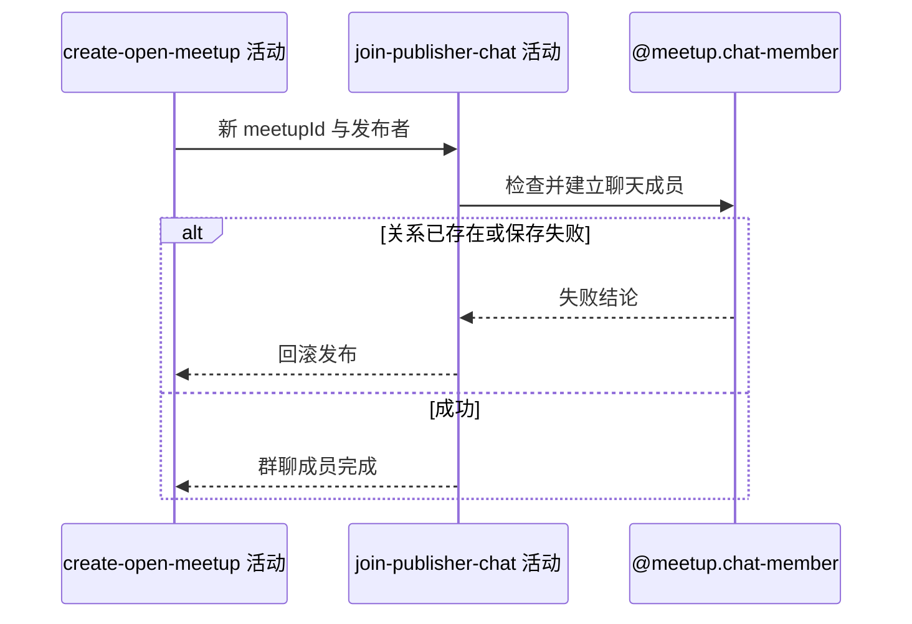

## 概要

为发布者建立初始未读数为零的约球群聊成员关系。

## 时序图

## 触发条件

上游已在当前事务内建立新约球及发布者报名后执行。

## 活动契约

### 入参

| 字段 | 类型 | 必填 | 约束 |
|---|---|---|---|
| `meetupId` | 字符串 | 是 | 本次新生成的约球编号 |
| `publisherId` | 字符串 | 是 | 约球发布者编号 |

### 成功返回

无业务数据；已建立发布者聊天成员关系。

## 异常分支

| 错误标识 | 触发条件 | 来源 |
|---|---|---|
| `ALREADY_JOINED_CHAT` | 新约球编号和发布者关系已存在 | publish-meetup 流程隐含群聊关系冲突 |
| `SYSTEM_ERROR` | 成员查询、唯一约束或保存失败 | publish-meetup 流程 `SYSTEM_ERROR` 一行 |

## 领域依赖

### @meetup.chat-member

- 输入：新约球编号、发布者编号与建立聊天成员的意图
- 输出：建立雪花编号、初始未读 0、当前加入时间的成员；关系已存在或保存失败时返回失败结论

## 业务动作

A1 检查发布者聊天关系不存在
A2 建立初始未读为零的新成员
A3 确认成员写入并继续授权额度登记

## 详细流程

1. `A1` 按 `refId+userId` 检查；理论上新雪花约球编号不会命中，若命中仍按 `ALREADY_JOINED_CHAT` 失败。
2. `A2` 生成成员雪花编号，保存 `unreadCount=0`、`joinedAt=当前时间`，已读消息编号与时间为空。
3. 不读取消息，发布时也没有历史消息需要折算未读。
4. 本活动与约球及发布者报名同一外层事务，检查或保存失败会回滚全部发布数据。

## 边界情况

- 约球编号碰撞或脏成员记录会使发布整体失败。
- 并发唯一冲突不按幂等成功处理。
- 成员写入成功后仍需等待外层事务提交才可见。

## 实现提示

保持成员与新约球同事务落库，避免产生成功发布但创建者不在群聊的状态。
