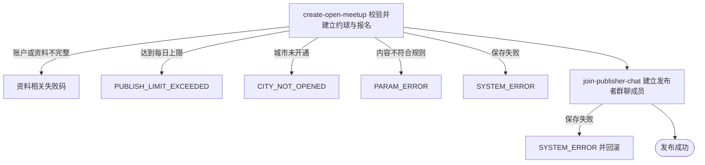

## 概要

为档案完整用户创建开放约球并建立首位参与关系。

## 触发

档案完整的登录用户提交一个普通约球时发起，调用方是用户端。一次请求创建一个约球；没有请求幂等键或内容去重，重复到达会在每日上限允许时创建不同约球。

## 接口契约

### 请求参数

| 字段 | 类型 | 必填 | 约束 |
|---|---|---|---|
| `title` | 字符串 | 否 | 最多 128 字符；空白时自动生成 |
| `matchType` | 枚举 | 是 | 单打、双打或拉球 |
| `maxPlayers` | 整数 | 是 | 2 至 16 |
| `startTime` | 日期时间 | 是 | 不得早于受理校验时刻 |
| `duration` | 小数 | 是 | 仅 0.5、1.0、1.5、2.0、2.5、3.0 小时 |
| `courtName` | 字符串 | 否 | 最多 128 字符 |
| `courtAddress` | 字符串 | 是 | 不可为空白，最多 256 字符 |
| `courtSelectMode` | 枚举 | 否 | `TEXT`、`MAP` 或 `FREE`；当前不校验与球场编号组合 |
| `courtId` | 字符串 | 否 | `TEXT`/`MAP` 命中时采用球场库资料，未命中不阻断 |
| `cityCode` | 字符串 | 是 | 不可为空白且须为已开通城市 |
| `districtCode` | 字符串 | 否 | 当前接收但不保存 |
| `courtLng` / `courtLat` | 小数 | 是 | 经度 -180 至 180，纬度 -90 至 90 |
| `levelMode` | 枚举 | 是 | `RANGE`、`EXACT`、`ABOVE` 或 `BELOW` |
| `levelMin` / `levelMax` | 小数 | 按模式 | 1.5 至 7.0，0.5 步长；模式组合按详细流程校验 |
| `genderLimit` | 枚举 | 是 | 不限、仅男性或仅女性 |
| `joinMode` | 枚举 | 是 | 直接加入或审批加入 |
| `costItems` | 费用项列表 | 否 | 原样保存；当前不校验名称、金额、数量和重复 |
| `courtIndex` | 字符串 | 否 | 前端透传保存 |

### 成功响应

无业务数据；成功表示约球、发布者报名和群聊成员已提交，不返回新约球编号或详情。

## 业务活动

- create-open-meetup  校验发布资格与内容，建立开放约球及发布者已加入报名
- join-publisher-chat  为发布者建立初始未读数为零的约球群聊成员关系

## 流程图

## 详细流程

1. 识别当前登录用户并读取账户、基础资料与网球档案；要求昵称头像不再是默认值，且网球档案处于正常或核查期。
2. 读取每日发布上限配置，统计当前用户当天存储状态为大写 `OPEN` 或小写 `full` 的约球；达到上限时拒绝。其他状态不计数。
3. 确认城市编码在已开通配置中，并校验请求必填、长度、人数、经纬度、开始时间、持续时长和 NTRP 模式组合。
4. 持续时长只接受 0.5 至 3.0 小时的六个半小时档；NTRP 边界须在 1.5 至 7.0 且为 0.5 步长，精确值缺少上界时自动以最低值补齐。
5. 文字搜索或地图选择且提供球场编号时查询球场；找到后采用球场名称、地址、坐标和区县，找不到或非对应模式时采用请求场地并从地址识别区县。
6. 建立新的普通约球编号，设置发布者、城市名、开始与结束时间、费用明细和 `OPEN` 状态；标题空白时按星期、活动形式、性别限制和审批要求生成。
7. 同时生成发布者报名业务编号，以 `JOINED` 建立首位参与关系；整体保存时按有效参与者重算当前人数为一。
8. 命中球场库时，当前映射还会沿用球场记录的创建与更新时间；约球编号和城市名随后由工厂重新生成、覆盖。
9. 为发布者建立初始未读数为零的群聊成员；失败时事务回滚约球和报名。
10. 返回发布成功；本流程不登记订阅信息，也不发送通知。

## 异常分支

| 对外失败码 | 触发条件 | 由哪个活动报出 | 补偿动作或超时处理 | 对外提示 |
|---|---|---|---|---|
| 请求校验失败 | 必填、长度、人数、坐标或 NTRP 单值范围不符合注解约束 | 流程 | 不建立约球 | 首个无效字段及校验说明 |
| `TOKEN_INVALID` | 当前身份没有账户 | create-open-meetup | 不建立约球 | 登录凭证无效，请重新登录 |
| `REGISTRATION_INCOMPLETE` / `USER_INCOMPLETE` / `ONBOARDING_INCOMPLETE` | 基础资料或网球档案未完成 | create-open-meetup | 不建立约球 | 提示完善个人信息或网球档案 |
| `PUBLISH_LIMIT_EXCEEDED` | 当日 `OPEN` 或小写 `full` 发布数达到配置上限 | create-open-meetup | 不建立约球 | 今日发布已达上限 |
| `CITY_NOT_OPENED` | 城市未配置为已开通，或城市编码缺失 | create-open-meetup | 不建立约球 | 该城市暂未开通 |
| `PARAM_ERROR` | 开始时间早于校验时刻、时长不是六个允许值，或 NTRP 模式边界、顺序、步长不符 | create-open-meetup | 不建立约球 | 对应发布时间、时长或水平提示 |
| `SYSTEM_ERROR` | 城市配置与名录不一致，约球、报名或群聊成员保存失败，或事务提交失败 | create-open-meetup / join-publisher-chat | 事务回滚本次约球、报名和群聊成员 | 系统异常，请稍后重试 |

球场编号未命中时按请求场地继续发布。命中球场库时，新约球会重新生成编号并按城市名录写城市名，但当前沿用球场记录的创建与更新时间。

## 技术线索

- HTTP 接口：`POST /meetup/publish`
- 状态：约球 `OPEN`，发布者报名 `JOINED`
- 配置：`anti_abuse.publish_per_day_limit`，默认 50
- 当日计数状态：`OPEN`、小写 `full`
- 场地模式：`TEXT`、`MAP`、`FREE`
