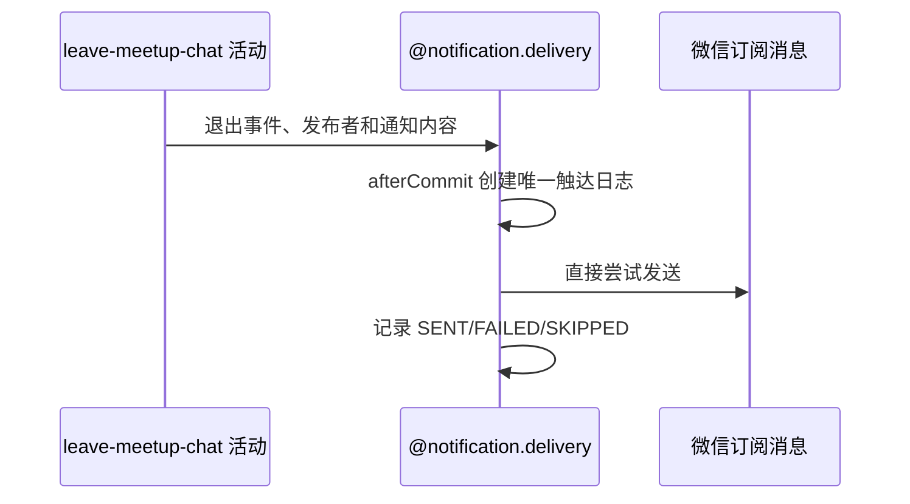

## 概要

退出事务提交后，以退出报名编号构造 `MEMBER_QUIT` 事件，异步尝试触达约球发布者。

## 时序图

## 详细流程

1. 通知内容包含约球名称、开始时间、退出成员昵称和退出时间。
2. `MEMBER_QUIT:registrationId` 使同一次退出对发布者和同一渠道最多触达一次；用户重新报名后再退出使用新报名编号，可产生新事件。
3. 建立唯一 `SENDING` 日志后直接调用微信；未订阅记 `SKIPPED`，渠道错误记 `FAILED`，成功记 `SENT`。
4. 本场景不使用成员资格过滤器，因为接收人是约球发布者，退出者是消息内容而不是接收人。

## 边界情况

发布者缺少 openid、未订阅、渠道失败或日志回写失败均不影响退出、人数重算和群聊移除结果。
