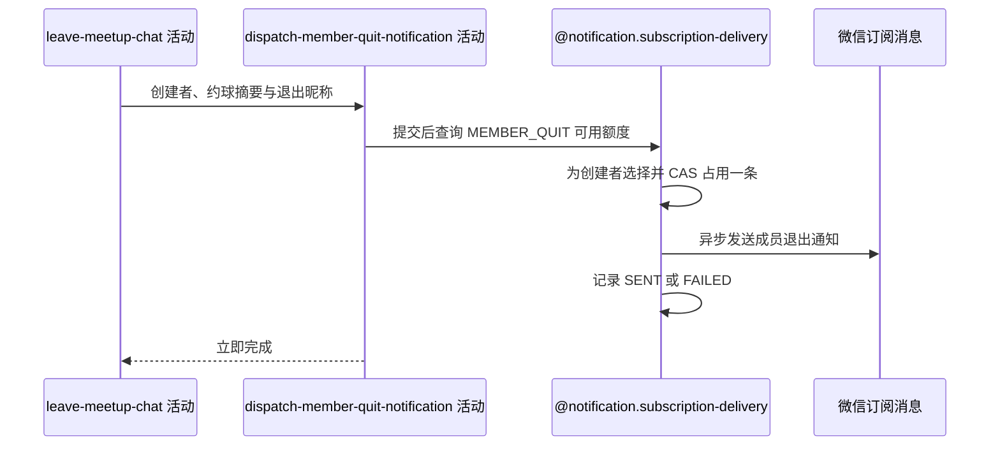

## 概要

在退出事务提交后异步向约球发布者发送成员退出通知。

## 时序图

## 触发条件

报名状态、人数与群聊删除事务成功提交后执行；候选接收人始终是约球记录中的创建者。

## 活动契约

### 入参

| 字段 | 类型 | 必填 | 约束 |
|---|---|---|---|
| `meetupId` | 字符串 | 是 | 已退出的约球编号 |
| `creatorId` | 字符串 | 是 | 约球原创建者编号 |
| `quitNickname` | 字符串 | 是 | 退出用户当前昵称 |
| `noticeData` | 约球摘要 | 是 | 活动名称、开始时间、退出昵称和当前退出时间 |

### 成功返回

无业务数据；只表示异步任务已登记，不保证发布者收到通知。

## 异常分支

无。无额度、渠道、发送与结果回写异常仅跳过或记录，不影响退出。

## 领域依赖

### @notification.subscription-delivery

- 输入：业务类型 `MEETUP`、约球编号、场景 `MEMBER_QUIT`、创建者和模板数据，以及消费一条可用额度的意图
- 输出：提交后至多占用创建者一条额度并记录发送结果；无额度、并发占用或通知异常时返回跳过/失败结论且不影响退出

## 业务动作

A1 以约球创建者作为唯一候选接收人
A2 在事务提交后异步选择并占用可用额度
A3 发送成员退出模板并记录结果

## 详细流程

1. `A1` 不排除退出者本人；发布者退出自己的普通约球时，候选接收人仍是本人。
2. 模板包含活动名、开始时间、退出人当前昵称和组装时的当前退出时间。
3. `A2` 核心事务提交后在线程池查询匹配 `MEETUP/meetupId/MEMBER_QUIT/creatorId/UNUSED` 的流水，只处理该用户最早一条并 CAS 到 `SENDING`。
4. 本调用没有成员资格过滤器，因此不会因发布者已退出而跳过；无额度或 CAS 失败直接结束。
5. `A3` 调用微信渠道，回写 `SENT/FAILED`；缺少渠道、身份、发送或回写异常只记录，接口不等待异步结果。
6. 没有通知级幂等键或持久化重试队列，退出成功不依赖通知结果。

## 边界情况

- 创建者没有 `MEMBER_QUIT` 授权额度时不发送。
- 发布者本人退出会尝试给本人发送“成员退出”通知。
- 重复业务触发可依次消费创建者的多条额度。
- 事务回滚时不会提交异步任务。

## 实现提示

微信 RPC snapshot 当前缺失；若发布者退出场景不应自通知，需要在活动选择接收人时显式排除，而非依赖成员过滤。
