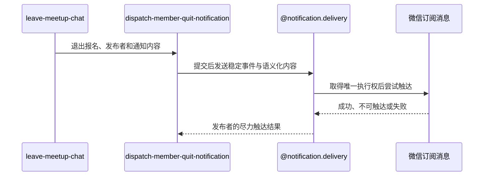

## 概要

退出事务提交后尽力通知约球发布者。

## 时序图

## 触发条件

报名变为 `QUIT`、人数重算和群聊成员删除已经在同一事务提交，并已取得退出人当前昵称。

## 活动契约

### 入参

| 字段 | 类型 | 必填 | 约束 |
|---|---|---|---|
| `registrationId` | 字符串 | 是 | 本次退出报名编号，用于构造稳定事件 |
| `meetupId` | 字符串 | 是 | 本次退出所属普通约球编号 |
| `creatorId` | 字符串 | 是 | 唯一通知接收人；可与退出人相同 |
| `meetupName` | 字符串 | 是 | 通知展示的活动名称 |
| `startTime` | 日期时间 | 是 | 通知展示的活动开始时间 |
| `quitUserNickname` | 字符串 | 是 | 离群活动读取的退出人当前昵称 |
| `quitTime` | 日期时间 | 是 | 通知展示的退出时间 |

### 成功返回

无业务数据；成功只表示已安排向发布者尽力触达，不表示发布者已经收到消息。

## 异常分支

无。重复事件、渠道不可达、触达日志或微信异常均在活动内跳过或记录，不改变退出结果。

## 领域依赖

### @notification.delivery

- 输入：`MEMBER_QUIT:registrationId` 稳定事件、约球业务上下文、发布者接收人、语义化退出内容和微信订阅渠道。
- 输出：发布者与渠道取得唯一执行权后形成成功、失败或预期跳过的触达结果，重复任务不再次发送；异常时不向退出流程传播失败，保留可审计结果或应用日志。

## 业务动作

- A1 以退出报名编号构造 `MEMBER_QUIT` 稳定事件和成员退出内容。
- A2 在退出事务提交后把发布者通知任务交给异步执行。
- A3 委托 `@notification.delivery` 取得微信触达执行权并尝试发送。
- A4 接受成功、失败、跳过或日志异常结果并结束，不修改退出终态。

## 详细流程

1. A1 通知内容包含约球名称、开始时间、退出成员当前昵称和退出时间；同一次退出始终使用同一报名事件。
2. A2 仅在报名、人数和群聊成员事务成功提交后进入线程池；事务回滚时不启动通知。
3. A3 接收人固定为约球发布者，不使用报名成员资格过滤器；发布者本人退出时接收人和退出人相同。
4. A3 只有唯一触达日志首次创建成功才调用微信；缺少接收身份或未订阅时接受预期跳过，其他渠道错误接受失败。
5. A4 结果回写异常只记应用日志；用户重新报名后再退出会使用新报名编号形成新事件。

## 边界情况

- 发布者编号为空时不创建触达任务，但不影响退出结果。
- 发布者缺少接收身份、未订阅、渠道失败或日志回写失败均不影响退出、人数重算和群聊移除结果。
- 同一退出任务重复执行时由事件、接收人和渠道唯一约束跳过。
- 进程中断可能留下 `SENDING` 触达日志；当前不自动重试。

## 实现提示

无
