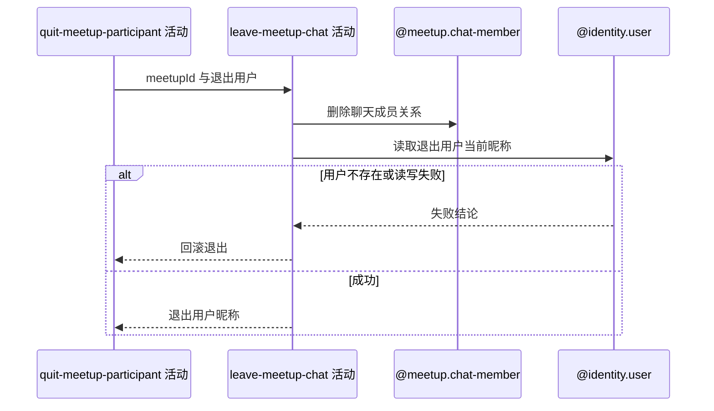

## 概要

删除退出用户的群聊成员关系并取得通知所需昵称，保留已有聊天消息。

## 时序图

## 触发条件

上游已在当前事务内把有效报名置为 `QUIT` 后执行。

## 活动契约

### 入参

| 字段 | 类型 | 必填 | 约束 |
|---|---|---|---|
| `meetupId` | 字符串 | 是 | 已完成状态变更的约球编号 |
| `userId` | 字符串 | 是 | 本次退出用户编号 |

### 成功返回

| 字段 | 类型 | 必填 | 说明 |
|---|---|---|---|
| `quitNickname` | 字符串 | 是 | 用户当前昵称，用于提交后退出通知 |

## 异常分支

| 错误标识 | 触发条件 | 来源 |
|---|---|---|
| `TOKEN_INVALID` | 退出用户账户不存在 | quit-meetup 流程 `TOKEN_INVALID` 一行 |
| `SYSTEM_ERROR` | 成员删除或用户资料读取失败 | quit-meetup 流程 `SYSTEM_ERROR` 一行 |

## 领域依赖

### @meetup.chat-member

- 输入：约球编号、退出用户编号与移除聊天成员的意图
- 输出：删除匹配成员；不存在时删除零条并仍返回完成，聊天消息不变

### @identity.user

- 输入：退出用户编号与取得当前昵称的意图
- 输出：账户存在时返回昵称；不存在或读取失败时返回失败结论

## 业务动作

A1 删除约球与退出用户的群聊成员关系
A2 读取退出用户当前昵称
A3 返回通知上下文并等待事务提交

## 详细流程

1. `A1` 按 `refId+userId` 直接删除成员；不先检查存在性，影响零行也视为成功。
2. 删除只作用于聊天成员表，不删除或匿名化退出人此前发送的聊天消息。
3. `A2` 在状态和成员变化后读取退出用户档案并断言账户存在，取当前昵称而非报名时快照。
4. 用户不存在时报 `TOKEN_INVALID`；该读取和成员删除都在外层事务内，失败会回滚上游报名 `QUIT` 和人数重算。
5. 成功后不清理通知额度或其他用户未读数。

## 边界情况

- 成员记录已缺失时退出仍可成功。
- 发布者退出时同样删除发布者聊天成员，但约球创建者编号保持不变。
- 历史消息继续显示发送时保存的姓名头像快照。
- 用户昵称在退出前变化时，通知使用最新值。

## 实现提示

成员删除保持幂等；若未来允许幽灵账户清理，需重新决定用户资料缺失是否应回滚已完成退出。
