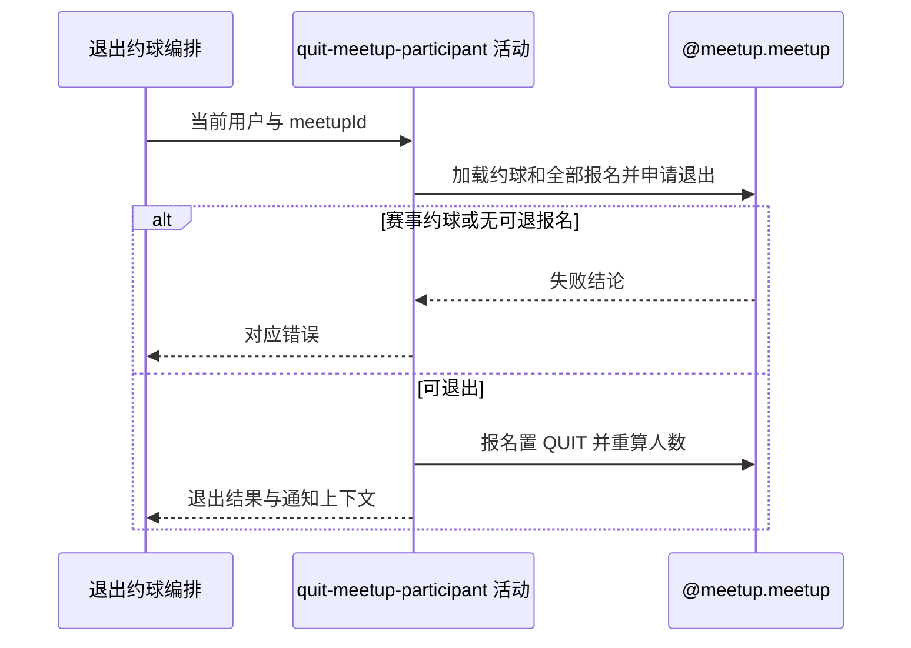

## 概要

校验普通约球和有效报名，将本人报名置为退出并重算当前人数。

## 时序图

## 触发条件

已登录用户提交非空约球编号后执行；不要求约球处于开放或开始前状态。

## 活动契约

### 入参

| 字段 | 类型 | 必填 | 约束 |
|---|---|---|---|
| `meetupId` | 字符串 | 是 | 非空白普通约球编号 |
| `userId` | 字符串 | 是 | 当前登录用户编号 |

### 成功返回

| 字段 | 类型 | 必填 | 说明 |
|---|---|---|---|
| `quitContext` | 退出上下文 | 是 | 退出用户、创建者、更新后人数、是否应处罚及通知摘要；接口不交付 |

## 异常分支

| 错误标识 | 触发条件 | 来源 |
|---|---|---|
| `MEETUP_NOT_FOUND` | 目标约球不存在 | quit-meetup 流程 `MEETUP_NOT_FOUND` 一行 |
| `MEETUP_TOURNAMENT_QUIT_FORBIDDEN` | 目标是赛事约球 | quit-meetup 流程 `MEETUP_TOURNAMENT_QUIT_FORBIDDEN` 一行 |
| `NOT_JOINED` | 本人没有可退出的有效报名 | quit-meetup 流程 `NOT_JOINED` 一行 |
| `SYSTEM_ERROR` | 约球或报名读写、配置读取及事务提交失败 | quit-meetup 流程 `SYSTEM_ERROR` 一行 |

## 领域依赖

### @meetup.meetup

- 输入：约球编号、当前用户、退出有效报名并判断临近开始处罚的意图
- 输出：普通约球中把 `JOINED/REVIEWED/SKIPPED` 报名置为 `QUIT`，重算人数并返回处罚与通知上下文；赛事约球、无报名或保存失败时返回相应结论

## 业务动作

A1 加载约球和报名并拒绝赛事约球
A2 定位本人可退出报名并置为 QUIT
A3 按开始时间与阈值判断是否应处罚
A4 整体保存报名并重算当前人数
A5 返回群聊删除和通知所需上下文

## 详细流程

1. `A1` 加载约球及全部报名；赛事类型立即拒绝，普通约球不检查 `DRAFT/OPEN/CLOSED/ONGOING/FINISHED` 或当前时间。
2. `A2` 先按本人查找 `PENDING` 或有效报名，再要求记录是 `JOINED/REVIEWED/SKIPPED`；`PENDING` 与终止历史最终均报 `NOT_JOINED`。发布者有创建时报名，因此也可退出自己的普通约球。
3. 把目标报名状态改为 `QUIT`，不改 `optTime/expiresAt`，其他历史记录保持不变。
4. `A3` 计算从当前时间到开始时间的整小时差，读取 `meetup.quit.penalty_threshold_hours`，小于阈值返回 `PENALIZED`，否则 `NORMAL`；开始后差值为负，仍判应处罚。
5. 当前应用层不消费处罚结果：不读取 `meetup.quit.penalty_under_6h`、不写信誉分，仅保留 TODO。
6. `A4` 按报名业务编号 upsert聚合内全部报名，并把 `currentPlayers` 重算为剩余 `JOINED/REVIEWED/SKIPPED` 数量；约球状态、创建者和其他字段不变。
7. 本活动与下游群聊删除、退出用户资料读取处在同一事务；任一下游失败会回滚状态与人数。

## 边界情况

- 重复退出时原记录已为 `QUIT`，下一次报 `NOT_JOINED`。
- 发布者退出后约球仍保留原创建者和状态，人数可降为零。
- `PENDING` 不能走退出，应使用撤回入口。
- 并发操作没有版本条件，各请求可能按旧聚合集合重算人数并覆盖。

## 实现提示

处罚目前只是未落地的判断值；在评分领域接入前不要把成功响应解释为已扣分。若限制开始后或发布者退出，需显式新增规则。
