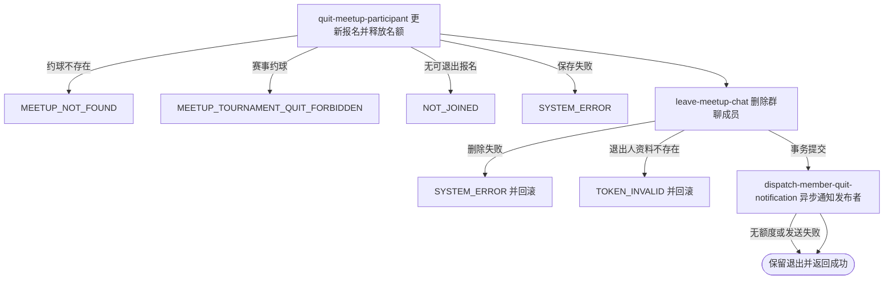

## 概要

让有效参与者退出普通约球、释放名额并离开群聊。

## 触发

普通约球的有效参与者决定退出时发起，调用方是登录用户端。一次请求处理当前用户在一个约球中的活动报名；重复到达时原报名已为 `QUIT`，后续请求按未报名拒绝。

## 接口契约

### 请求参数

| 字段 | 类型 | 必填 | 约束 |
|---|---|---|---|
| `meetupId` | 字符串 | 是 | 不可为空白，目标普通约球编号 |

### 成功响应

无业务数据；成功表示报名、当前人数和群聊成员关系已提交。接口不交付剩余人数、处罚判断、退出后的详情或通知结果。

## 业务活动

- quit-meetup-participant  校验普通约球和有效报名，将本人报名置为退出并重算当前人数
- leave-meetup-chat  删除本人群聊成员关系但保留已有聊天消息
- dispatch-member-quit-notification  在提交后异步向约球发布者发送成员退出通知

## 流程图

## 详细流程

1. 接收非空约球编号，识别当前登录用户并读取约球及全部报名记录。
2. 目标是赛事约球时拒绝；普通约球不校验草稿、报名中、进行中、已结束或已关闭状态，也不校验当前时间。
3. 查找本人待审核或有效报名，只有 `JOINED`、`REVIEWED`、`SKIPPED` 可退出；`PENDING` 和其他终止状态按未报名拒绝。发布者本人也可退出自己的普通约球。
4. 将报名状态改为 `QUIT`，不更新报名操作时间，并按剩余有效报名重算约球当前人数；约球状态和发布者编号保持不变。
5. 按距开始时间的整小时差与处罚阈值配置判断普通退出或应处罚；活动已经开始时差为负，也会判为应处罚。当前结果只保存在调用栈中，不读取处罚分值、不扣信誉分、不向调用方返回。
6. 整体保存约球与报名后删除本人群聊成员关系；关系不存在时删除零条并继续，不删除历史消息。
7. 读取退出人当前昵称；资料不存在时按登录凭证无效失败，并由事务回滚报名、人数和群聊变更。
8. 事务提交后异步向约球发布者尝试发送成员退出通知；发布者本人退出时收件人也是本人。
9. 返回退出成功，不交付剩余人数、处罚判断、群聊或通知结果。

## 异常分支

| 对外失败码 | 触发条件 | 由哪个活动报出 | 补偿动作或超时处理 | 对外提示 |
|---|---|---|---|---|
| 请求校验失败 | `meetupId` 为空白 | 流程 | 不修改报名和群聊 | 约球ID不能为空 |
| `MEETUP_NOT_FOUND` | 目标约球不存在 | quit-meetup-participant | 不修改报名和群聊 | 约球不存在 |
| `MEETUP_TOURNAMENT_QUIT_FORBIDDEN` | 目标是赛事约球 | quit-meetup-participant | 不修改报名和比赛 | 这是赛事约球，无法在此退出，请返回比赛页面进行相关操作 |
| `NOT_JOINED` | 本人没有 `JOINED`、`REVIEWED` 或 `SKIPPED` 报名 | quit-meetup-participant | 保留待审核或历史终止报名 | 你未报名该约球 |
| `TOKEN_INVALID` | 完成状态变更后读取不到退出人资料 | leave-meetup-chat | 同一事务回滚报名、当前人数和群聊删除 | 登录凭证无效，请重新登录 |
| `SYSTEM_ERROR` | 约球、报名或群聊读写及事务提交失败 | quit-meetup-participant / leave-meetup-chat | 同一事务回滚本次报名、人数和群聊变更 | 系统异常，请稍后重试 |

群聊成员记录不存在时删除零条并继续，聊天消息保留。退出通知没有可用额度、微信身份缺失或发送失败时只跳过或记录失败，不改变退出结果。并发退出没有版本条件，当前人数由各自加载的聚合重新计算。

## 技术线索

- HTTP 接口：`POST /meetup/registration/quit`
- 报名终态：`QUIT`；可退出来源 `JOINED`、`REVIEWED`、`SKIPPED`
- 配置：`meetup.quit.penalty_threshold_hours`
- 未使用配置：`meetup.quit.penalty_under_6h`
- 通知场景：`MEMBER_QUIT`，事务提交后发送给发布者
