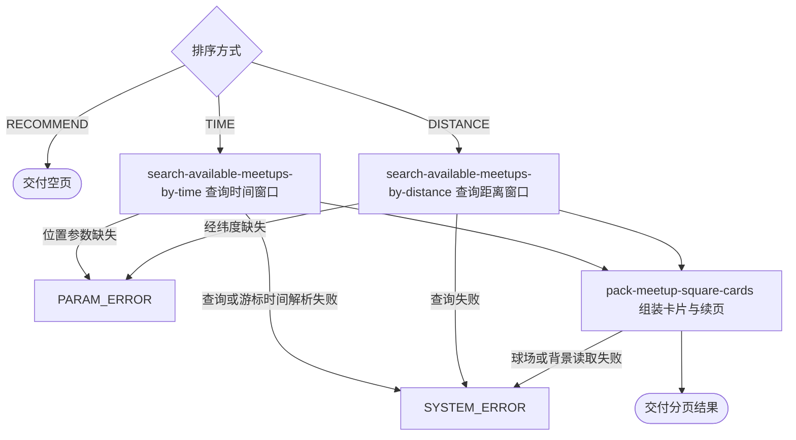

## 概要

分页交付指定城市当前开放且尚未结束的约球卡片。

## 触发

用户端或匿名访问端浏览约球广场、切换筛选或继续翻页时发起。一次请求处理一个城市的一页结果；相同查询可重复执行，但当前时间、约球变化及距离游标失效会使页面内容变化或从首页重新开始。

## 接口契约

### 请求参数

| 字段 | 类型 | 必填 | 约束 |
|---|---|---|---|
| `cityCode` | 字符串 | 是 | 不可为空白 |
| `sort` | 枚举 | 是 | `TIME`、`DISTANCE` 或 `RECOMMEND` |
| `pageSize` | 整数 | 否 | 默认 10，最小 1；无最大值，显式空值会失败 |
| `lastId` | 字符串 | 否 | 上页 `nextCursor`；非法编码通常按首页 |
| `lng` / `lat` | 小数 | 按条件 | 距离排序必填；时间排序指定半径时必填；无范围校验 |
| `radiusKm` | 小数 | 否 | 距离半径；无正数和上限校验 |
| `matchType` | 枚举 | 否 | 单打、双打或拉球 |
| `startTime` / `endTime` | 日期时间 | 否 | 开球时间闭区间；不校验先后顺序 |
| `levelMode` | 枚举 | 否 | 当前不参与筛选 |
| `levelMin` / `levelMax` | 小数 | 否 | 两者同时存在时按区间交集筛选，单边忽略 |
| `tags` | 字符串列表 | 否 | 当前不参与筛选 |

### 成功响应

| 字段 | 类型 | 说明 |
|---|---|---|
| `list` | 卡片列表 | 当前页约球卡片 |
| `list[].meetupId` | 字符串 | 约球编号 |
| `list[]` 其他字段 | 对象字段 | 标题、类型、人数、开球时间、时长、城市区县、场地、背景、水平、状态、距离和主标签 |
| `total` | 空值 | 当前固定不统计总量 |
| `hasMore` | 布尔值 | 是否还有下一页 |
| `nextCursor` | 字符串或空值 | 仅 `hasMore=true` 时交付；时间排序含编号与开球时间，其他排序含编号 |

## 业务活动

- search-available-meetups-by-time  按开球时间与复合游标查询开放且未结束的约球窗口
- search-available-meetups-by-distance  按球面距离排序全量候选并用约球编号截取窗口
- pack-meetup-square-cards  为当前页约球补充距离、主标签和降级背景并组成分页结果

## 流程图

## 详细流程

1. 接收城市、排序、页大小、续页标识及可选的类型、时间、水平、位置和半径条件；标签与水平模式字段当前不参与筛选。
2. 解码续页标识；空白、非 Base64 或非 JSON 数组按首页处理。时间排序游标包含约球编号和开球时间，距离排序只包含约球编号。
3. 推荐排序当前不查询数据，直接交付空页。
4. 时间排序时选取指定城市、存储状态严格为 `OPEN` 且结束时间晚于查询时刻的约球，按开球时间、约球编号升序；有半径时必须同时提供经纬度并限制球面距离。
5. 距离排序时要求经纬度，选取同样开放且未结束、场地有坐标的约球，在数据库计算球面距离并按距离、约球编号升序；随后在完整排序结果中定位上一页末项并截取窗口。
6. 两种排序均应用可选活动形式和开球时间边界；只有查询 NTRP 上下限同时存在时才按区间交集筛选，单边条件忽略。
7. 时间排序多查一项判断后续页；距离排序先查全部符合项，再在内存取页大小加一项。游标项不在当前距离结果中时从首页重新截取。
8. 为本页每项组装卡片；有查询位置时计算公里距离，状态为开放时用区县作主标签，并按关联球场环境、材质、开球时段和晴天天气降级规则形成背景。
9. 交付列表、固定为空的总量、是否有下一页，以及仅在还有下一页时生成的续页标识。

## 异常分支

| 对外失败码 | 触发条件 | 由哪个活动报出 | 补偿动作或超时处理 | 对外提示 |
|---|---|---|---|---|
| 请求校验失败 | 城市为空、排序未提供或页大小小于一 | 流程 | 只读查询，无需补偿 | 对应字段校验提示 |
| `PARAM_ERROR` | 距离排序缺经纬度，或时间排序指定半径却缺经纬度 | search-available-meetups-by-time / search-available-meetups-by-distance | 只读查询，无需补偿 | 参数错误 |
| `SYSTEM_ERROR` | 显式空页大小、可解码但时间格式非法的游标，约球/球场/距离查询或卡片包装失败 | 对应查询活动 / pack-meetup-square-cards | 只读查询，无需补偿；调用方可去掉游标重试首页 | 系统异常，请稍后重试 |

无结果和 `RECOMMEND` 均返回空列表、`hasMore=false`。非法游标通常按首页；距离游标记录已不在当前结果时也从首页。关联球场缺失或环境材质为空时背景降级为室外硬地晴天，不影响卡片交付。

## 技术线索

- HTTP 接口：`POST /meetup/list`
- 查询状态：`OPEN` 且 `end_time > NOW()`
- 距离：`ST_Distance_Sphere`，按米计算、响应换算公里
- 时间游标：`start_time`、`biz_id` 升序；距离游标：`biz_id` 内存定位
- 背景时段：06:00—17:00 白天、17:00—19:00 黄昏、19:00—06:00 夜间，天气按晴天
