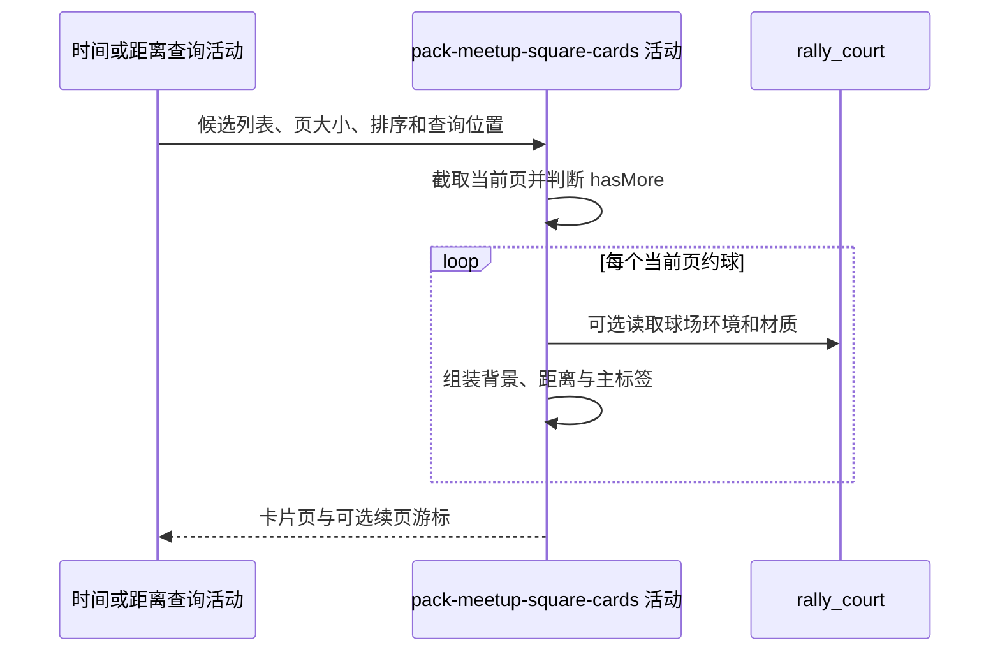

## 概要

为当前页约球补充距离、主标签和降级背景并组成分页结果。

## 时序图

## 触发条件

时间或距离查询返回候选窗口后执行；`RECOMMEND` 分支不进入本活动并直接交付空页。

## 活动契约

### 入参

| 字段 | 类型 | 必填 | 约束 |
|---|---|---|---|
| `candidates` | 约球列表 | 是 | 已按所选排序排列，最多 `pageSize+1` 条 |
| `pageSize` | 整数 | 是 | 当前页保留数量 |
| `sort` | 枚举 | 是 | `TIME` 或 `DISTANCE` |
| `lng` / `lat` | 小数 | 否 | 两者同时存在时计算响应公里距离 |

### 成功返回

| 字段 | 类型 | 必填 | 说明 |
|---|---|---|---|
| `list` | 卡片列表 | 是 | 当前页卡片，可能为空 |
| `total` | 空值 | 否 | 固定为 null |
| `hasMore` | 布尔值 | 是 | 候选数是否大于 pageSize |
| `nextCursor` | 字符串 | 否 | 仅有下一页时生成；TIME 含编号与开球时间，DISTANCE 只含编号 |

## 异常分支

| 错误标识 | 触发条件 | 处理 |
|---|---|---|
| `SYSTEM_ERROR` | 球场读取、卡片映射、距离或游标编码失败 | 终止只读活动 |
| 无 | 候选为空 | 返回空页 |

## 领域依赖

无

## 业务动作

A1 以多取一项判断后续页并截取当前页
A2 映射约球基础卡片和区域主标签
A3 补充查询点距离与球场背景
A4 构造分页结果及排序对应游标

## 详细流程

1. `A1` 候选数大于 `pageSize` 时置 `hasMore=true` 并移除多取项，否则全部保留；`total` 始终为 null。
2. `A2` 映射编号、标题、活动形式、人数、开球时间、时长、城市区县、场地、水平范围和状态；广场结果通常为 OPEN，因此主标签取 `districtName`。
3. `A3` 经度纬度均非空时按球面算法用查询点和约球场地坐标计算公里距离；返回值不直接复用距离 SQL 的 `distanceMeters`。
4. 有 `courtId` 时读取球场 `type/surface`；记录缺失或字段为空时按室外硬地降级，天气固定按晴天，时段由开始时间划分白天、黄昏或夜间。
5. `A4` 仅 `hasMore=true` 且当前页非空时以末项生成 URL-safe Base64 JSON 游标；TIME 编码 `[meetupId,startTime]`，DISTANCE 编码 `[meetupId]`。
6. 空结果或末页 `nextCursor=null`，不修改任何业务数据。

## 边界情况

- 查询位置只传一项时不计算响应距离。
- 关联球场被删除或停用仍按编号读取；读取不到时使用默认背景。
- 翻页游标不包含筛选条件，调用方改变条件后仍可能被接受。
- 大页大小会同步逐项查球场缓存并组装大量卡片。

## 实现提示

球场只读字段已按当前 DB snapshot 列明；可批量预取当前页球场，避免冷缓存下逐卡片回源。
