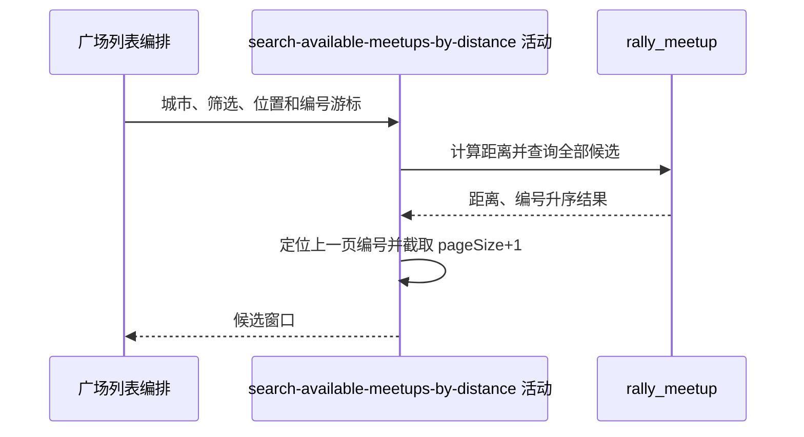

## 概要

按球面距离排序全量候选并用约球编号截取窗口。

## 时序图

## 触发条件

请求排序为 `DISTANCE` 且经纬度均已提供后执行。

## 活动契约

### 入参

| 字段 | 类型 | 必填 | 约束 |
|---|---|---|---|
| `cityCode` | 字符串 | 是 | 精确匹配 |
| `lng` / `lat` | 小数 | 是 | 距离计算点；无范围校验 |
| `radiusKm` | 小数 | 否 | 可选半径，无正数和上限校验 |
| `lastBizId` | 字符串 | 否 | 上一页末项编号 |
| `pageSize` | 整数 | 是 | 大于等于 1；内存多取 1 条 |
| `matchType` / `startTime` / `endTime` / `levelMin` / `levelMax` | 筛选参数 | 否 | 与时间查询同口径 |

### 成功返回

按球面距离、约球编号升序截取的候选列表，最多 `pageSize+1` 条；每项带距离米数。

## 异常分支

| 错误标识 | 触发条件 | 处理 |
|---|---|---|
| `PARAM_ERROR` | 经度或纬度缺失 | 终止只读活动 |
| `SYSTEM_ERROR` | 球面距离函数或约球查询失败 | 终止只读活动 |
| 无 | 无匹配或游标位于末尾 | 返回空列表 |

## 领域依赖

无

## 业务动作

A1 校验位置并规划城市与可选筛选
A2 在数据库计算球面距离并排序全量候选
A3 在内存定位编号游标并截取窗口

## 详细流程

1. `A1` 断言经纬度非空；固定筛选指定城市、`status='OPEN'`、`end_time>NOW()` 且场地经纬度非空。
2. 活动形式、开球时间闭区间及水平区间交集与时间查询一致；`levelMode`、`tags` 不参与。
3. `A2` 用 `ST_Distance_Sphere(POINT(court_lng,court_lat),POINT(lng,lat))` 计算米数；有半径时用公里乘 1000 过滤。
4. SQL 不分页，返回全部符合项，按 `distance_meters,biz_id` 升序；相同距离由编号稳定排序。
5. `A3` 在完整列表中线性查找 `lastBizId`，命中后从下一项截取 `pageSize+1`；空游标从首项开始。
6. 游标编号未出现在当前结果时起点保持零，即重新从首页返回；末项游标返回空列表。

## 边界情况

- 非法经纬度可能由数据库函数报错，当前请求层未校验范围。
- 负半径通常无结果，极大半径可触发全城扫描。
- 数据量增长时每页都全量算距离、排序并传回应用内存。
- 游标项因状态、时间或筛选变化消失时会重返首页，可能重复卡片。

## 实现提示

查询字段已按当前 DB snapshot 声明；若改为数据库 search-after，游标需同时携带距离与编号并保持同序比较。
