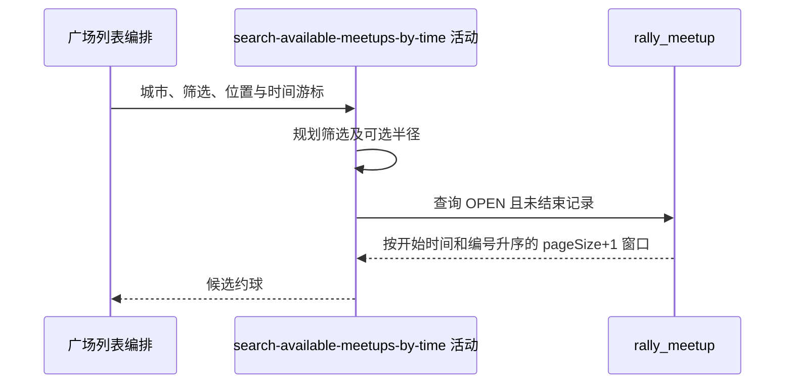

## 概要

按开球时间与复合游标查询开放且未结束的约球窗口。

## 时序图

## 触发条件

请求排序为 `TIME` 且已解码续页标识后执行；指定半径时必须同时提供经纬度。

## 活动契约

### 入参

| 字段 | 类型 | 必填 | 约束 |
|---|---|---|---|
| `cityCode` | 字符串 | 是 | 精确匹配城市编码 |
| `pageSize` | 整数 | 是 | 大于等于 1；活动多取 1 条 |
| `lastBizId` / `lastStartTime` | 字符串 / 日期时间 | 否 | 时间排序复合游标，二者来自同一续页标识 |
| `matchType` | 枚举 | 否 | 精确匹配 |
| `startTime` / `endTime` | 日期时间 | 否 | 开球时间闭区间，单边可用 |
| `levelMin` / `levelMax` | 小数 | 否 | 仅同时存在时应用区间交集 |
| `lng` / `lat` / `radiusKm` | 位置参数 | 否 | 有半径时经纬度必填；半径换算为米 |

### 成功返回

按 `start_time,biz_id` 升序的候选列表，最多 `pageSize+1` 条；无匹配时为空列表。

## 异常分支

| 错误标识 | 触发条件 | 处理 |
|---|---|---|
| `PARAM_ERROR` | 指定半径但经度或纬度缺失 | 终止只读活动 |
| `SYSTEM_ERROR` | 游标时间转换或约球查询失败 | 终止只读活动，可去掉游标重试首页 |
| 无 | 城市内没有符合项 | 返回空列表 |

## 领域依赖

无

## 业务动作

A1 规划城市、状态、时间、类型、水平和半径筛选
A2 应用复合 search-after 游标查询约球
A3 按开球时间与编号升序返回多一项窗口

## 详细流程

1. `A1` 固定筛选 `city_code=cityCode`、存储 `status='OPEN'` 且 `end_time>查询时刻`，因此已开始但未结束的 OPEN 记录仍会入选。
2. 可选 `matchType` 精确匹配；`startTime/endTime` 分别对开球时间做大于等于/小于等于，不校验两者顺序。
3. 只有查询水平上下限同时存在才检查区间交集：约球空边界视为无限制；`levelMode` 与 `tags` 不参与筛选。
4. 有 `radiusKm` 时断言经纬度非空，将公里乘 1000，并用 `ST_Distance_Sphere` 对场地坐标过滤；半径未校验正数和上限。
5. `A2` 有上一页开始时间时查询其后记录：开球时间更晚，或时间相同且编号更大；仅有编号而无时间时不应用游标。
6. `A3` 按 `start_time,biz_id` 升序并限制 `pageSize+1`，多出项只供上层判断 `hasMore`。

## 边界情况

- 空白、非 Base64 或非 JSON 游标在流程层按首页；可解码但第二项不是合法时间时查询前失败。
- 半径为零只保留距离完全相同记录，负半径通常返回空列表。
- 开始时间已过但尚未结束的 OPEN 记录仍在广场。
- 翻页期间数据新增或时间推进可导致跨页遗漏或重复。

## 实现提示

查询字段已按当前 DB snapshot 声明；复合游标须继续与排序键同序，避免只按编号翻页。
