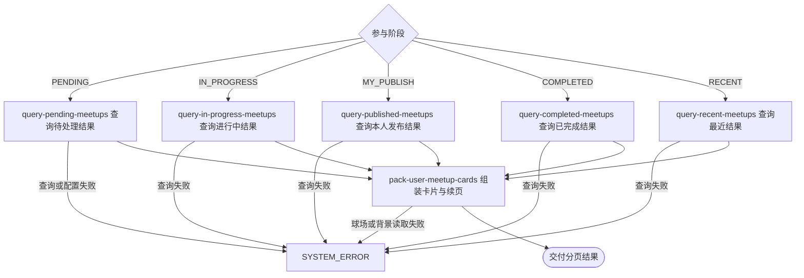

## 概要

按本人选择的参与阶段分页交付约球卡片。

## 触发

已登录用户打开“我的约球”并选择参与阶段或继续翻页时发起，调用方是用户端。一次请求处理当前用户一个阶段的一页结果；重复查询只读，但约球、报名、评价、消息和当前时间变化会影响结果。

## 接口契约

### 请求参数

| 字段 | 类型 | 必填 | 约束 |
|---|---|---|---|
| `tab` | 枚举 | 是 | `PENDING`、`IN_PROGRESS`、`MY_PUBLISH`、`COMPLETED` 或 `RECENT` |
| `lastId` | 字符串 | 否 | 上页 `nextCursor`；空白或非法编码按首页 |
| `size` | 整数 | 否 | 默认 10、最小 1；无最大值，显式空值会失败 |

### 成功响应

| 字段 | 类型 | 说明 |
|---|---|---|
| `list` | 卡片列表 | 当前阶段的一页约球卡片；待处理可能重复同一约球 |
| `list[]` | 对象 | 约球编号、标题、类型、人数、时间、城市区县、场地、背景、水平、存储状态和主标签 |
| `total` | 空值 | 当前固定不统计总量 |
| `hasMore` | 布尔值 | 是否还有下一页 |
| `nextCursor` | 字符串或空值 | 仅有下一页时交付，以本页最后约球编号编码 |

## 业务活动

- query-pending-meetups  合并本人待审批、待评价和有未读消息的约球结果
- query-in-progress-meetups  查询本人发布或有效参与且开放未结束的约球
- query-published-meetups  查询本人创建的全部非草稿约球
- query-completed-meetups  查询本人报名已评价或已跳过的非草稿约球
- query-recent-meetups  查询本人发布或有效参与的全部非草稿约球
- pack-user-meetup-cards  按参与阶段补充主标签与背景并组成分页结果

## 流程图

## 详细流程

1. 识别当前登录用户，接收参与阶段、页大小和可选续页标识；续页解码为空或非法时按首页，解码首项不是字符串时系统失败。
2. 待处理阶段合并三类记录：本人发布、状态为 `OPEN` 或大写 `FULL`、未结束且有待审批报名的约球；本人仍为 `JOINED`、已结束且处于评价期限内的约球；本人发布或有效参与、非草稿且聊天未读数大于零的约球。
3. 待处理合并使用带不同原因字段的 `UNION`；同一约球命中不同原因时因整行不同可重复出现，并分别显示待审批、待评价或未读标签，没有原因优先级。
4. 进行中阶段选取本人发布或具有有效报名、存储状态严格为 `OPEN` 且结束时间未到的约球；不包含持久化 `ONGOING`。
5. 我发布阶段选取本人创建的全部非草稿约球；已完成阶段只按本人报名为 `REVIEWED` 或 `SKIPPED` 且约球非草稿判断，不检查结束时间与状态；最近阶段选取本人发布或有效参与的全部非草稿约球，不设时间窗口。
6. 各阶段按约球业务编号倒序，用上一页最后编号作为严格小于的续页条件，多查一项判断是否有下一页。
7. 为本页每项组装卡片和背景；待处理使用命中原因作主标签，进行中和已完成使用区县，我发布和最近对已过结束时间的 `OPEN` 显示已结束，否则显示存储状态文案。
8. 交付列表、固定为空的总量、是否有下一页及仅在有下一页时生成的编号游标，不修改报名、评价和群聊已读。

## 异常分支

| 对外失败码 | 触发条件 | 由哪个活动报出 | 补偿动作或超时处理 | 对外提示 |
|---|---|---|---|---|
| 请求校验失败 | 未选择参与阶段或页大小小于一 | 流程 | 只读查询，无需补偿 | 对应 tab 或 size 校验提示 |
| `TOKEN_INVALID` / `TOKEN_EXPIRED` | 登录凭证无效或过期 | 流程 | 不查询本人数据 | 登录凭证无效或登录已过期，请重新登录 |
| `SYSTEM_ERROR` | 非法参与阶段无法转换、显式空页大小、游标首项非字符串、约球/报名/群聊/配置/球场读取或卡片包装失败 | 对应查询活动 / pack-user-meetup-cards | 只读查询，无需补偿；可去掉游标重试首页 | 系统异常，请稍后重试 |

没有符合项时交付空列表和 `hasMore=false`。评价期限配置不能解析为整数时按零天处理。待处理同一约球因不同原因可重复；非法续页编码按首页，可能重复已看内容。球场资料缺失时背景按室外硬地晴天降级。

## 技术线索

- HTTP 接口：`POST /meetup/user/list`
- 待处理原因：`PENDING_APPROVAL`、`PENDING_REVIEW`、`UNREAD_MESSAGES`
- 待处理状态：`OPEN`、大写 `FULL`；评价期限配置 `review.deadline_days`
- 分页：各阶段按 `biz_id` 倒序 search-after
- 背景：关联球场环境、材质与固定开球时段，天气按晴天
