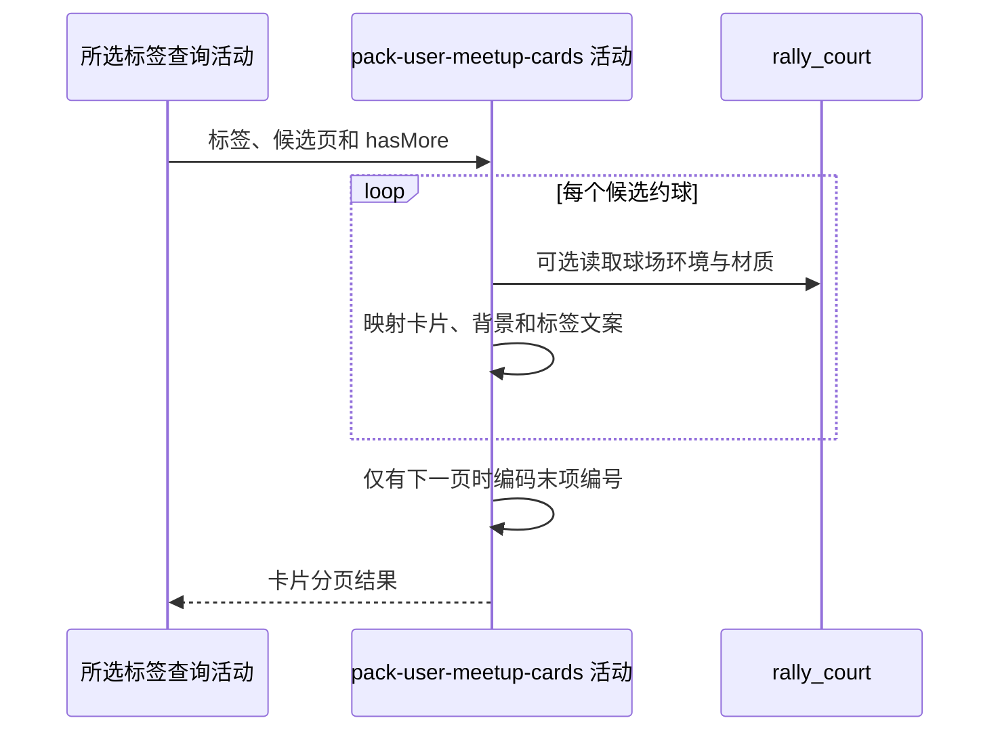

## 概要

按参与阶段补充主标签与背景并组成分页结果。

## 时序图

## 触发条件

五个标签查询之一完成并返回已截取当前页的结果后执行。

## 活动契约

### 入参

| 字段 | 类型 | 必填 | 约束 |
|---|---|---|---|
| `tab` | 枚举 | 是 | 本次 `PENDING/IN_PROGRESS/MY_PUBLISH/COMPLETED/RECENT` |
| `meetups` | 约球列表 | 是 | 仓储已移除多取项的当前页 |
| `hasMore` | 布尔值 | 是 | 仓储根据 `size+1` 候选计算 |

### 成功返回

卡片列表、固定 null 的 total、hasMore，以及仅在有下一页时由末项约球编号生成的 nextCursor。

## 异常分支

| 错误标识 | 触发条件 | 处理 |
|---|---|---|
| `SYSTEM_ERROR` | 卡片枚举映射、球场读取、背景解析或游标编码失败 | 终止只读活动 |
| 无 | 查询页为空 | 返回空页 |

## 领域依赖

无

## 业务动作

A1 映射每项约球基础卡片
A2 按标签选择主标签文案
A3 补充球场背景降级键
A4 组装分页元数据与编号游标

## 详细流程

1. `A1` 映射约球编号、标题、形式、人数、时间、城市区县、场地、水平范围及存储状态，不计算距离。
2. `A2` 对 `PENDING` 使用查询计算的待处理原因文案；`IN_PROGRESS/COMPLETED` 使用区县名。
3. `MY_PUBLISH/RECENT` 若存储状态为 `OPEN` 且结束时间早于当前时刻，主标签显示 `FINISHED` 文案，否则使用存储状态文案；只修正展示，不修改状态字段。
4. `A3` 有 `courtId` 时读取球场 `type/surface`，结合开始时间与固定晴天选背景；缺记录或字段为空时降级室外硬地晴天。
5. `A4` `total=null`，沿用仓储 `hasMore`；只有 hasMore 为 true 且列表非空时，将末项 `meetupId` 编成 URL-safe Base64 JSON 数组游标。
6. 活动不清理未读、不更新评价或约球状态。

## 边界情况

- 待处理同一约球多原因时会生成多张卡片，各自标签不同。
- PENDING 原因缺失时主标签为空。
- 球场缺失不阻断卡片，使用默认背景。
- 空页或末页 `nextCursor=null`，非法旧游标由流程按首页处理。

## 实现提示

球场只读字段已按当前 DB snapshot 声明；可批量预取当前页球场以减少冷缓存逐项回源。
