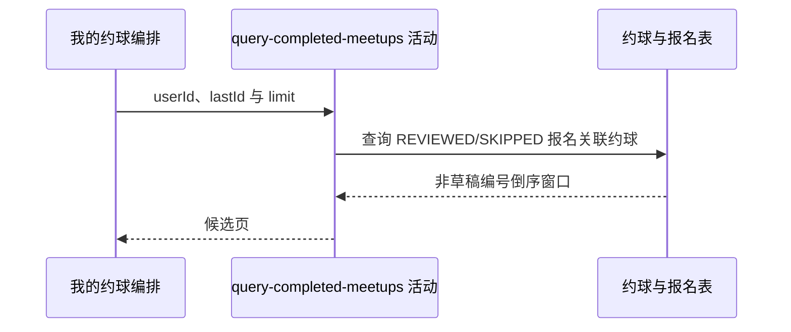

## 概要

查询本人报名已评价或已跳过的非草稿约球。

## 时序图

## 触发条件

已登录用户选择 `COMPLETED` 标签后执行。

## 活动契约

入参为当前 `userId`、可选 `lastId` 和 `size+1` 的 `limit`；返回本人完成态报名关联的非草稿约球窗口。

## 异常分支

| 错误标识 | 触发条件 | 处理 |
|---|---|---|
| `SYSTEM_ERROR` | 约球或报名查询、枚举映射失败 | 终止只读活动 |

## 领域依赖

无

## 业务动作

A1 定位本人 REVIEWED 或 SKIPPED 报名
A2 排除草稿约球并应用编号游标
A3 返回编号倒序分页窗口

## 详细流程

1. 子查询要求 `user_id=userId` 且报名状态为 `REVIEWED/SKIPPED`，再选择其关联约球。
2. 约球只要求 `status!='DRAFT'`；不检查结束时间、存储 FINISHED 或创建者关系，因此错误提前进入完成态的报名也会入选。
3. 多条完成态报名关联同一约球时 `IN` 语义仍只返回一条约球。
4. 有游标时保留 `biz_id<lastId`，按编号倒序限制 `size+1`，不统计 total。

## 边界情况

- 已结束但报名仍为 JOINED 的约球不入选。
- REVIEWED/SKIPPED 约球即使存储 OPEN 且未来开始也会入选。
- 发布者若没有完成态报名，不会仅凭创建关系入选。
- 翻页期间评价状态变化可能移动记录集合。

## 实现提示

只读字段已按当前 DB snapshot 声明；“已完成”当前代表评价流程完成，而非约球时间或状态完成。
