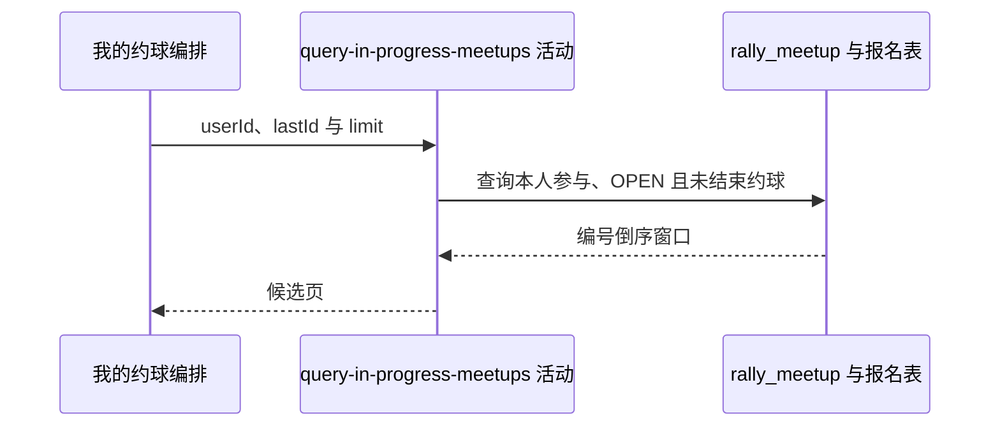

## 概要

查询本人发布或有效参与且开放未结束的约球。

## 时序图

## 触发条件

已登录用户选择 `IN_PROGRESS` 标签后执行。

## 活动契约

入参为当前 `userId`、可选上一页 `lastId` 和 `size+1` 的 `limit`；返回编号倒序分页候选，无匹配时为空。

## 异常分支

| 错误标识 | 触发条件 | 处理 |
|---|---|---|
| `SYSTEM_ERROR` | 约球或报名查询、状态映射失败 | 终止只读活动 |

## 领域依赖

无

## 业务动作

A1 识别本人创建或有效参与关系
A2 筛选开放且未结束约球
A3 应用编号游标并返回多一项窗口

## 详细流程

1. 候选须由本人创建，或本人有 `JOINED/REVIEWED/SKIPPED` 报名。
2. 约球存储状态须严格为 `OPEN` 且 `end_time>NOW()`；不依据开始时间，因此未开始与已开始未结束均入选，不包含存储 `ONGOING/FULL`。
3. 有游标时保留 `biz_id<lastId`，按编号倒序并限制 `limit=size+1`。
4. 仓储截掉多取项并返回 `hasMore`，不统计 total、不修改报名。

## 边界情况

- 发布者即使没有报名记录也因创建关系入选。
- 有效参与者退出或报名状态改变后下一次查询消失。
- 编号排序大致反映创建顺序，但不按开始时间排序。
- 翻页期间状态变化可能造成遗漏或重复。

## 实现提示

只读字段已按当前 DB snapshot 声明；标签名“进行中”当前实际包含尚未开始的 OPEN 约球。
