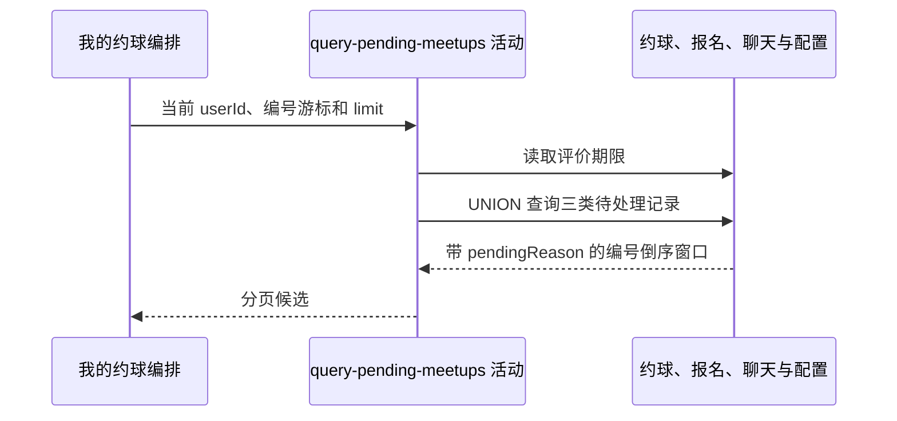

## 概要

合并本人待审批、待评价和有未读消息的约球结果。

## 时序图

## 触发条件

已登录用户选择 `PENDING` 标签后执行；流程已把页大小转换为 `size+1` 并解析可选编号游标。

## 活动契约

### 入参

| 字段 | 类型 | 必填 | 约束 |
|---|---|---|---|
| `userId` | 字符串 | 是 | 当前登录用户编号 |
| `lastId` | 字符串 | 否 | 上页末项约球编号 |
| `limit` | 整数 | 是 | `size+1`，用于判断后续页 |

### 成功返回

带 `PENDING_APPROVAL/PENDING_REVIEW/UNREAD_MESSAGES` 原因的约球窗口，按编号倒序；同一约球可出现多次。

## 异常分支

| 错误标识 | 触发条件 | 处理 |
|---|---|---|
| `SYSTEM_ERROR` | 配置、约球、报名或聊天查询及枚举映射失败 | 终止只读活动 |
| 无 | 没有待处理事项 | 返回空列表 |

## 领域依赖

无

## 业务动作

A1 读取评价截止天数
A2 查询创建者的待审批约球
A3 查询参与者的待评价约球
A4 查询本人仍有资格且有未读消息的约球
A5 合并原因、应用游标并返回分页窗口

## 详细流程

1. `A1` 读取 `review.deadline_days`；缓存或默认值不能解析为整数时返回 0 天，而非报错。
2. `A2` 选择本人创建、状态为大写 `OPEN/FULL`、`end_time>NOW()` 且存在任意 `PENDING` 报名的约球，原因置 `PENDING_APPROVAL`。
3. `A3` 选择存储 `FINISHED`，或 `OPEN/FULL` 且已过结束时间，并满足 `end_time+deadlineDays>NOW()`、本人报名仍为 `JOINED` 的约球，原因置 `PENDING_REVIEW`。
4. `A4` 选择非 `DRAFT`、本人聊天成员 `unread_count>0`，且本人是创建者或具有 `JOINED/REVIEWED/SKIPPED` 报名的约球，原因置 `UNREAD_MESSAGES`。
5. 三支使用 `UNION` 合并。原因字段不同使同一约球命中不同分支时不会去重；相同分支自身由存在性判断最多一行。
6. 有 `lastId` 时保留 `biz_id<lastId`，整体按编号倒序并限制 `limit`；仓储把最后多取一项用于 `hasMore`，不统计总量。
7. 活动不审批报名、不创建评价，也不清零未读数。

## 边界情况

- 评价期限为 0 时，`end_time+0天>NOW()` 通常使已结束记录立即过期。
- 同一约球可能以两个或三个原因重复出现在同页，且没有优先级。
- 使用约球编号而非原因作游标；重复行跨页边界时可能遗漏同编号的另一原因。
- SQL 状态严格区分大小写口径，未包含 `ONGOING`。

## 实现提示

只读字段已按当前 DB snapshot 声明；若要求一约球一卡，应先定义原因优先级，再以编号分组后分页。
