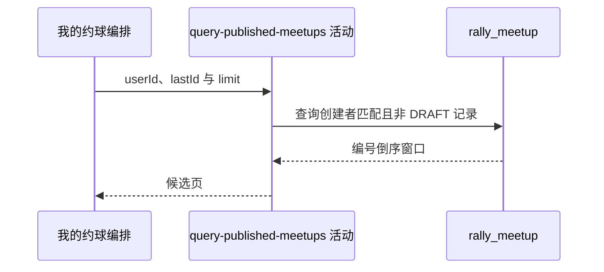

## 概要

查询本人创建的全部非草稿约球。

## 时序图

## 触发条件

已登录用户选择 `MY_PUBLISH` 标签后执行。

## 活动契约

入参为当前 `userId`、可选 `lastId` 和 `size+1` 的 `limit`；返回本人创建的非草稿约球编号倒序窗口。

## 异常分支

| 错误标识 | 触发条件 | 处理 |
|---|---|---|
| `SYSTEM_ERROR` | 约球查询或枚举映射失败 | 终止只读活动 |

## 领域依赖

无

## 业务动作

A1 按创建者筛选本人约球
A2 排除草稿并应用编号游标
A3 返回多一项分页窗口

## 详细流程

1. 固定 `creator_id=userId` 且 `status!='DRAFT'`，不限制普通/赛事类型、时间或其他状态。
2. 不依赖报名记录；即使创建者已把本人报名置为退出，约球仍入选。
3. 有游标时保留 `biz_id<lastId`，按编号倒序限制 `size+1`，仓储据多取项计算 `hasMore`。
4. 不统计 total，也不懒更新已过期 OPEN 的存储状态。

## 边界情况

- OPEN、FULL、ONGOING、FINISHED、CLOSED 等非草稿状态都可出现。
- 编号排序不是开始时间或更新时间排序。
- 状态在跨页间变化为 DRAFT 时可造成页长变化。
- 查询不核实创建者用户记录仍存在。

## 实现提示

只读字段已按当前 DB snapshot 声明；状态展示修正留给卡片包装，不回写主表。
