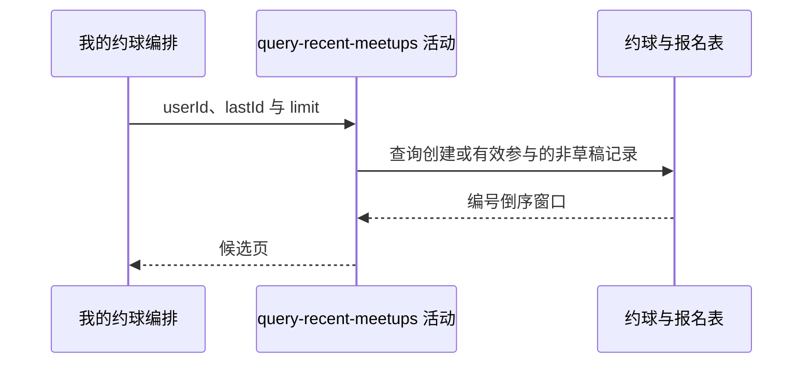

## 概要

查询本人发布或有效参与的全部非草稿约球。

## 时序图

## 触发条件

已登录用户选择 `RECENT` 标签后执行。

## 活动契约

入参为当前 `userId`、可选 `lastId` 和 `size+1` 的 `limit`；返回本人创建或有效参与的非草稿约球窗口。

## 异常分支

| 错误标识 | 触发条件 | 处理 |
|---|---|---|
| `SYSTEM_ERROR` | 约球或报名查询、枚举映射失败 | 终止只读活动 |

## 领域依赖

无

## 业务动作

A1 识别本人创建或有效参与的约球
A2 排除草稿并应用编号游标
A3 返回编号倒序分页窗口

## 详细流程

1. 约球须 `status!='DRAFT'`，且本人是创建者或有 `JOINED/REVIEWED/SKIPPED` 报名。
2. 不限制时间窗口、约球状态或活动类型；“最近”仅表示编号倒序，不设天数范围。
3. 创建者不依赖报名状态，即使本人创建时报名已 `QUIT` 仍入选；普通参与者退出后不再入选，除非也是创建者。
4. 有游标时保留 `biz_id<lastId`，按编号倒序限制 `size+1`，不统计 total。

## 边界情况

- 历史很久的约球仍可随着翻页返回。
- 编号顺序假设雪花编号与创建时间大致一致，不按 `create_time` 明确排序。
- 活跃报名重复记录不会复制约球，因为使用 EXISTS。
- 翻页期间新建记录只出现在重新查询首页时。

## 实现提示

只读字段已按当前 DB snapshot 声明；如产品需要固定“最近”窗口，应新增明确时间条件。
