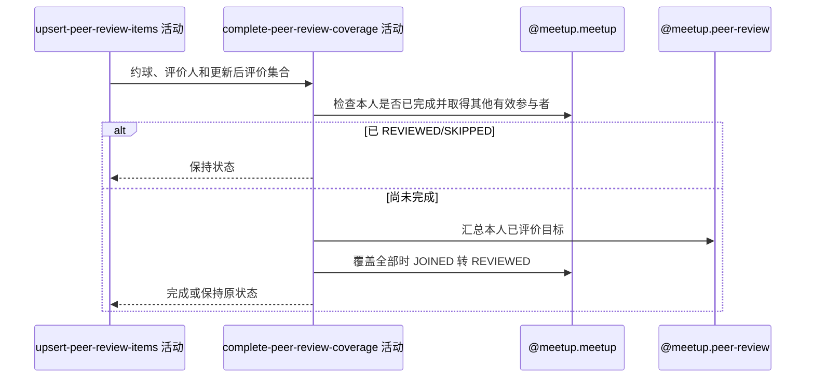

## 概要

汇总被评价目标覆盖范围，满足条件时把本人已加入报名置为已评价。

## 时序图

## 触发条件

同服务上游完成本次评价项写入后、事务提交前执行；空评价列表也执行。

## 活动契约

### 入参

| 字段 | 类型 | 必填 | 约束 |
|---|---|---|---|
| `meetupId` | 字符串 | 是 | 本次评价约球 |
| `fromUserId` | 字符串 | 是 | 当前评价人 |
| `participants` | 报名集合 | 是 | 上游加载的当前聚合报名视图 |

### 成功返回

无业务数据；满足覆盖且本人报名为 `JOINED` 时已转 `REVIEWED` 并记录操作时间，否则保持原状态。

## 异常分支

| 错误标识 | 触发条件 | 来源 |
|---|---|---|
| `SYSTEM_ERROR` | 评价汇总、报名条件更新或事务提交失败 | submit-peer-review 流程 `SYSTEM_ERROR` 一行 |

## 领域依赖

### @meetup.peer-review

- 输入：约球编号、评价人编号与汇总其全部已评价目标的意图
- 输出：返回评价记录对应的去重目标用户集合；读取失败时返回失败结论

### @meetup.meetup

- 输入：评价人、全部报名、目标覆盖集合，以及完成本人复盘的意图
- 输出：已完成时保持状态；覆盖除本人外全部有效参与者时把匹配的 `JOINED` 报名置 `REVIEWED` 并写操作时间

## 业务动作

A1 短路已评价或已跳过报名
A2 计算除本人外的有效参与者目标集合
A3 汇总本人在该约球评价过的目标用户
A4 覆盖完整时条件更新本人报名状态

## 详细流程

1. `A1` 聚合中存在本人 `REVIEWED` 或 `SKIPPED` 报名即直接结束；仍允许上游评价值已被更新。
2. `A2` 所需目标是除本人外全部 `JOINED/REVIEWED/SKIPPED` 报名用户，`PENDING` 与终止历史不计入；重复有效报名可能在列表重复，但后续 `containsAll` 不要求重复次数。
3. 所需集合为空时直接尝试完成，不查询评价记录。
4. `A3` 读取本人在该约球的全部评价维度，取 `toUserId` 去重；一个目标任意一个维度即算已覆盖，不要求三种维度齐全。
5. 已评价的自评或无关目标留在集合但不能替代缺失的有效参与者；覆盖全部所需目标时进入更新。
6. `A4` 数据库只把 `userId+meetupId+status=JOINED` 的报名改为 `REVIEWED` 并写 `opt_time=当前时间`；`PENDING` 虽可提交评价，但条件更新零行且接口仍成功。
7. 无检查更新行数，也不返回覆盖进度；评价与报名更新同事务提交。

## 边界情况

- 只有自己一个有效参与者时，空评价列表也可把 JOINED 推进为 REVIEWED。
- 一个 TAG 或任一单维度评价即可覆盖该目标。
- 并发时基于加载时参与者集合判断，新参与者稍后加入不会撤销已完成状态。
- 本人聚合状态为 JOINED、数据库已被并发改为其他状态时更新零行但仍成功。

## 实现提示

领域依赖仅登记契约、未设计；若产品要求逐维度完成，应把覆盖键从目标用户扩展为目标用户加必需维度集合。
