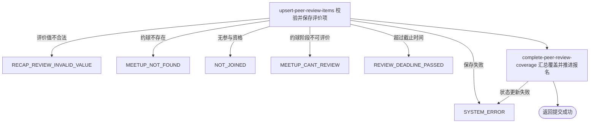

## 概要

保存本人对一位用户的同场评价并推进复盘完成状态。

## 触发

约球进行中或结束后的参与用户提交对一位目标用户的评价时发起，调用方是登录用户端。一次请求处理一个约球、一个目标用户和零到多个评价维度；重复提交按维度覆盖既有值，没有请求版本或幂等键。

## 接口契约

### 请求参数

| 字段 | 类型 | 必填 | 约束 |
|---|---|---|---|
| `meetupId` | 字符串 | 是 | 不可为空白，目标约球编号 |
| `toUserId` | 字符串 | 是 | 不可为空白；当前不验证是否本人、账户或同场参与者 |
| `reviews` | 评价项列表 | 实际必需 | 无非空注解；缺失会系统失败，空列表可成功 |
| `reviews[].type` | 枚举 | 是 | `LEVEL_VOTE`、`ATTENDANCE_VOTE` 或 `TAG` |
| `reviews[].value` | 字符串 | 按类型 | 水平与出勤须为允许枚举；标签仅要求非 `null` |

### 成功响应

无业务数据；成功表示评价项已新增或替换，并已按覆盖情况尝试推进本人报名。接口不交付评价编号、保存内容、覆盖进度或报名新状态。

## 业务活动

- upsert-peer-review-items  校验维度和值，按评价唯一组合新增或替换本人对目标用户的评价
- complete-peer-review-coverage  汇总被评价目标覆盖范围，满足条件时把本人已加入报名置为已评价

## 流程图

## 详细流程

1. 接收约球、被评价用户和评价项列表，识别当前登录用户；评价列表缺失或包含空项时当前会系统失败，空列表则继续处理。
2. 逐项校验维度和值：水平只接受 `HIGHER`、`SAME`、`LOWER`，出勤只接受 `ON_TIME`、`LATE`、`NO_SHOW`，标签只要求值不为 `null`，允许空白、自定义、逗号文本及无长度限制。
3. 读取约球及全部报名，确认当前用户是发布者或具有待审核、已加入、已评价、已跳过报名；确认实际状态为进行中或已结束，且当前时刻不晚于结束时间加评价期限。
4. 不校验被评价人是否本人、是否存在账户或是否属于本场；一次请求只把全部评价项关联到同一个被评价用户。
5. 按约球、评价人、被评价人和评价维度查找既有评价；存在则替换值，不存在则生成评价编号并新增。同一请求重复维度按顺序处理，后项覆盖前项。
6. 评价项全部保存在同一事务后，若本人报名已是 `REVIEWED` 或 `SKIPPED`，不再推进状态。
7. 否则汇总本人曾评价过的全部目标用户，与除本人外的全部有效参与者比较；全部覆盖或没有其他有效参与者时，尝试把本人 `JOINED` 报名改为 `REVIEWED` 并记录操作时间。
8. 本人报名为 `PENDING` 时可以保存评价，但状态更新条件只匹配 `JOINED`，因此保持待审核；不相关或自评目标通常不计入覆盖集合。
9. 返回提交成功，不交付评价内容、覆盖进度或复盘详情。

## 异常分支

| 对外失败码 | 触发条件 | 由哪个活动报出 | 补偿动作或超时处理 | 对外提示 |
|---|---|---|---|---|
| 请求校验失败 | 约球或被评价人为空白，评价类型为空 | 流程 | 不保存评价 | 对应字段不能为空 |
| `RECAP_REVIEW_INVALID_VALUE` | 水平、出勤值不在允许枚举，或标签值为 `null` | upsert-peer-review-items | 校验在事务前完成，不保存任何评价 | 评价值不合法 |
| `MEETUP_NOT_FOUND` | 目标约球不存在 | upsert-peer-review-items | 不保存评价 | 约球不存在 |
| `NOT_JOINED` | 当前用户不是发布者，也没有待审核或有效报名 | upsert-peer-review-items | 不保存评价 | 你未报名该约球 |
| `MEETUP_CANT_REVIEW` | 实际状态不是进行中或已结束 | upsert-peer-review-items | 不保存评价 | 约球不可评价 |
| `REVIEW_DEADLINE_PASSED` | 当前时刻晚于结束时间加评价期限 | upsert-peer-review-items | 不保存评价 | 评价已超期 |
| `SYSTEM_ERROR` | 评价列表缺失或含空项、评价/报名读写或事务提交失败 | upsert-peer-review-items / complete-peer-review-coverage | 评价写入与报名推进位于同一事务，整体回滚 | 系统异常，请稍后重试 |

空评价列表仍会按既有评价检查覆盖，可能把 `JOINED` 推进为 `REVIEWED`。自评或无关目标会保存但不替代正常覆盖目标。`PENDING` 可以评价但不会被状态更新 SQL 改写；`REVIEWED`、`SKIPPED` 可继续替换评价且保持原状态。

## 技术线索

- HTTP 接口：`POST /recap/review`
- 评价唯一组合：约球、评价人、被评价人、评价维度
- 评价维度：`LEVEL_VOTE`、`ATTENDANCE_VOTE`、`TAG`
- 截止配置：`review.deadline_days`，默认 30 天
- 报名推进：仅 `JOINED` 更新为 `REVIEWED` 并写 `opt_time`
