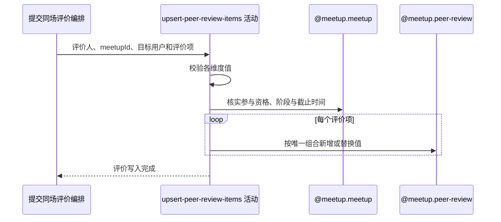

## 概要

校验维度和值，按评价唯一组合新增或替换本人对目标用户的评价。

## 时序图

## 触发条件

已登录用户提交非空约球编号、目标用户编号及通过类型非空校验的评价项后执行；评价列表本身没有非空约束。

## 活动契约

### 入参

| 字段 | 类型 | 必填 | 约束 |
|---|---|---|---|
| `meetupId` | 字符串 | 是 | 非空白 |
| `fromUserId` | 字符串 | 是 | 当前登录用户 |
| `toUserId` | 字符串 | 是 | 非空白；不验证账户、同场或非本人 |
| `reviews` | 评价项列表 | 实际必需 | null 会系统失败，空列表可继续 |
| `reviews[].type` | 枚举 | 是 | `LEVEL_VOTE/ATTENDANCE_VOTE/TAG` |
| `reviews[].value` | 字符串 | 按类型 | 水平/出勤必须是允许枚举名；TAG 只要求非 null |

### 成功返回

无业务数据；评价项已逐维度新增或替换，供下游覆盖判定使用。

## 异常分支

| 错误标识 | 触发条件 | 来源 |
|---|---|---|
| `RECAP_REVIEW_INVALID_VALUE` | 水平/出勤值非法或 TAG 值为 null | submit-peer-review 流程对应错误一行 |
| `MEETUP_NOT_FOUND` | 目标约球不存在 | submit-peer-review 流程 `MEETUP_NOT_FOUND` 一行 |
| `NOT_JOINED` | 当前用户不是创建者且无待审核或有效报名 | submit-peer-review 流程 `NOT_JOINED` 一行 |
| `MEETUP_CANT_REVIEW` | 约球实际状态不是进行中或已结束 | submit-peer-review 流程 `MEETUP_CANT_REVIEW` 一行 |
| `REVIEW_DEADLINE_PASSED` | 当前时间晚于结束时间加评价期限 | submit-peer-review 流程对应错误一行 |
| `SYSTEM_ERROR` | 评价列表缺失/含空项、配置或约球读取、评价写入及事务提交失败 | submit-peer-review 流程 `SYSTEM_ERROR` 一行 |

## 领域依赖

### @meetup.meetup

- 输入：约球编号、评价人，以及核实参与资格、评价阶段和截止时间的意图
- 输出：返回约球和全部有效参与者上下文；不存在、无资格、阶段或期限不允许时返回相应结论

### @meetup.peer-review

- 输入：约球、评价人、目标用户、评价维度和值，以及按唯一维度保存的意图
- 输出：存在相同四元组时替换值，否则建立新雪花评价记录；写入失败时返回失败结论

## 业务动作

A1 校验评价项维度和值
A2 核实评价人资格、约球阶段与截止时间
A3 按约球、双方用户和维度查找既有评价
A4 替换既有值或新增评价记录
A5 完成全部评价项写入

## 详细流程

1. `A1` 水平只接受 `HIGHER/SAME/LOWER`，出勤只接受 `ON_TIME/LATE/NO_SHOW`；TAG 仅拒绝 null，允许空白、自定义、逗号串及数据库列容量内长文本。
2. `reviews=null` 在遍历时失败，列表含 null 项也失败；空列表通过并进入后续活动。
3. `A2` 评价人须是创建者，或具有 `PENDING/JOINED/REVIEWED/SKIPPED` 报名；实际状态须为 `ONGOING/FINISHED`，且当前时间不晚于 `endTime+review.deadline_days`。
4. 不校验 `toUserId` 是否存在、是否本人或是否为本场参与者，自评和无关目标均可保存。
5. `A3-A4` 对每项按 `meetupId/fromUserId/toUserId/reviewType` 查询；存在则只更新 `reviewValue`，不存在生成雪花编号并新增。
6. 同一请求重复维度按列表顺序执行，后项覆盖前项；不同维度分别保存。
7. 全部写入和下游报名推进处在同一事务，任一保存或状态更新异常整体回滚。

## 边界情况

- 空评价列表不写评价，但仍可能由既有覆盖推进报名。
- 自评或无关用户评价会永久存在，却通常不计入所需覆盖目标。
- 并发首次提交同一维度可能由数据库唯一约束裁决，当前不重试为更新。
- 已 REVIEWED/SKIPPED 用户仍可继续覆盖评价值。

## 实现提示

领域依赖仅登记契约、未设计 `@meetup.peer-review`；若收紧目标资格，应同时定义历史无关评价如何处理。
