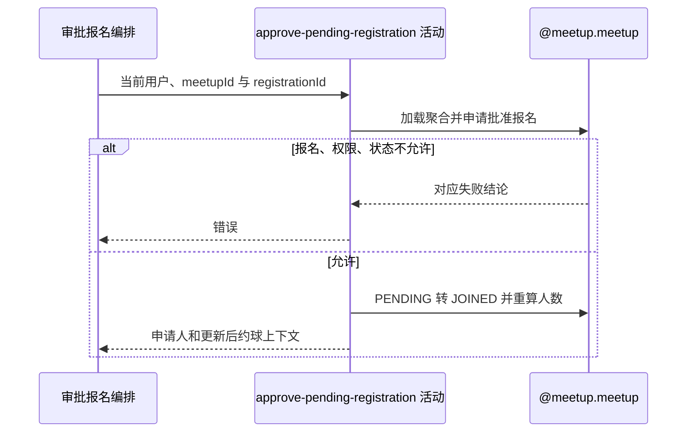

## 概要

校验发布者、报名和约球阶段，将待审核报名置为已加入并重算人数。

## 时序图

## 触发条件

已登录用户提交非空约球与业务报名编号后执行。

## 活动契约

入参为 `meetupId`、`registrationId` 和当前 `approverId`；成功返回申请人编号、有效参与者、人数上限、是否满员及通知摘要，不直接对外交付。

## 异常分支

| 错误标识 | 触发条件 | 来源 |
|---|---|---|
| `MEETUP_NOT_FOUND` | 约球不存在 | approve-registration 流程对应错误一行 |
| `WAITLIST_NOT_FOUND` | 报名不存在或不属于该约球 | approve-registration 流程对应错误一行 |
| `NOT_CREATOR` | 当前用户不是发布者 | approve-registration 流程对应错误一行 |
| `WAITLIST_NOT_PENDING` | 报名不是 PENDING | approve-registration 流程对应错误一行 |
| `MEETUP_STATUS_ILLEGAL` | 实际状态 FINISHED 或 CLOSED | approve-registration 流程对应错误一行 |
| `SYSTEM_ERROR` | 约球、报名读写或事务提交失败 | approve-registration 流程 `SYSTEM_ERROR` 一行 |

## 领域依赖

### @meetup.meetup

- 输入：约球、报名、审批人，以及校验归属、权限、报名状态和约球活跃性的意图
- 输出：允许时把目标 `PENDING` 报名转 `JOINED`、重算人数并返回申请人和通知上下文；不允许或保存失败时返回相应结论

## 业务动作

A1 加载约球和全部报名并定位业务报名
A2 核实审批人为发布者、报名待审核且约球活跃
A3 把报名置 JOINED 并整体保存
A4 重算人数并返回申请人及满员上下文

## 详细流程

1. `A1` 只在当前约球聚合的报名集合按业务编号查找，其他约球报名视为不存在。
2. `A2` 要求当前用户是创建者、报名为 `PENDING`，且实际状态不是 `FINISHED/CLOSED`；`DRAFT/OPEN/ONGOING` 均可审批。
3. 不检查容量、加入模式、`expiresAt`、申请人账户资料、性别、NTRP、信誉或时间冲突。
4. `A3` 仅把状态改为 `JOINED`，不更新 `optTime/expiresAt`；整体按报名编号 upsert 并重算 `currentPlayers`。
5. 容量判断发生在更新后，达到或超过 `maxPlayers` 都视为满员；没有首次满员或从未满到满的变化判断。
6. 本活动与群聊成员写入同事务，下游失败会回滚状态和人数。

## 边界情况

- 串行重复审批因不再 PENDING 被拒绝。
- 并发审批无名额预占和版本条件，可能超过上限。
- 已过自动撤回时间但尚未被撤回的 PENDING 仍可批准。
- 进行中的普通约球仍可批准新成员。

## 实现提示

若治理超员，应在聚合存储层以条件更新保护容量；本轮保留现有审批口径。
