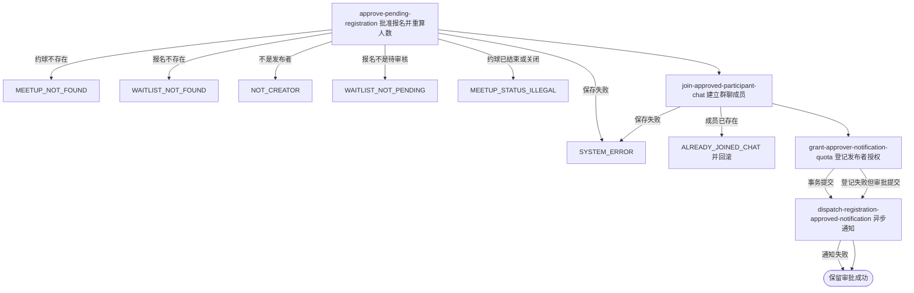

## 概要

由发布者将待审核报名批准为已加入并接入群聊。

## 触发

约球发布者处理一条待审核报名时发起，调用方是登录用户端。一次请求批准一个约球内的一条报名；重复提交在首请求成功后因状态不再为 `PENDING` 而拒绝，并发审批没有名额或报名版本保护。

## 接口契约

### 请求参数

| 字段 | 类型 | 必填 | 约束 |
|---|---|---|---|
| `meetupId` | 字符串 | 是 | 不可为空白，目标约球编号 |
| `registrationId` | 字符串 | 是 | 不可为空白，目标业务报名编号 |
| `acceptedNoticeScenes` | 字符串列表 | 否 | 发布者本次授权场景；非法项忽略，重复项不去重 |

### 成功响应

无业务数据；成功表示报名、当前人数和群聊成员关系已经提交，不表示通知已送达。接口不交付申请人、报名新状态、当前人数、群聊或授权结果。

## 业务活动

- approve-pending-registration  校验发布者、报名和约球阶段，将待审核报名置为已加入并重算人数
- join-approved-participant-chat  为获批申请人建立初始未读数为零的群聊成员关系
- dispatch-registration-approved-notification  在提交后按是否满员异步发送组团成功或报名成功通知
- grant-approver-notification-quota  按发布者本次可识别授权场景尽力登记后续通知额度

## 流程图

## 详细流程

1. 接收约球、报名和发布者本次通知授权场景，识别当前登录用户并读取约球及全部报名。
2. 按业务报名编号在该约球聚合中查找申请；确认当前用户是发布者、报名为 `PENDING`，且约球实际状态不是已结束或已关闭。
3. 不检查剩余名额、加入方式、报名自动撤回时间，也不重新核对申请人账户、档案、性别、NTRP、信誉或时间冲突；草稿和进行中约球可通过审批。
4. 将报名状态改为 `JOINED`，不写报名操作时间，并按全部有效报名重算约球当前人数；并发审批没有名额占用或版本条件，可能超员。
5. 为申请人建立初始未读数为零的群聊成员；已有成员记录时拒绝并回滚报名和人数，既有历史消息不计为初始未读。
6. 审批后人数达到或超过上限时，登记提交后向全部有效参与者异步发送组团成功通知；否则登记向申请人发送报名成功通知。没有首次满员判断。
7. 解析并尝试登记发布者本次授权场景；所有已知约球或赛事场景均可登记，非法项忽略、重复不去重，登记失败不撤销审批。
8. 事务提交后执行已登记的异步通知，并立即向调用方返回审批成功；不交付申请人、报名状态、当前人数、群聊或通知结果。

## 异常分支

| 对外失败码 | 触发条件 | 由哪个活动报出 | 补偿动作或超时处理 | 对外提示 |
|---|---|---|---|---|
| 请求校验失败 | 约球编号或报名编号为空白 | 流程 | 不修改报名 | 活动id或报名ID不能为空 |
| `MEETUP_NOT_FOUND` | 目标约球不存在 | approve-pending-registration | 不修改报名 | 约球不存在 |
| `WAITLIST_NOT_FOUND` | 报名编号不存在或不属于该约球 | approve-pending-registration | 不修改报名 | 报名记录不存在 |
| `NOT_CREATOR` | 当前用户不是约球发布者 | approve-pending-registration | 不修改报名 | 仅发布者可操作 |
| `WAITLIST_NOT_PENDING` | 目标报名不再为 `PENDING` | approve-pending-registration | 保留现有报名状态 | 该报名当前状态不可撤回 |
| `MEETUP_STATUS_ILLEGAL` | 约球实际已结束或已关闭 | approve-pending-registration | 不修改报名 | 约球状态不允许该操作 |
| `ALREADY_JOINED_CHAT` | 申请人已有该约球群聊成员记录 | join-approved-participant-chat | 整体事务回滚报名和当前人数 | 你已加入该聊天 |
| `SYSTEM_ERROR` | 约球、报名、群聊读写或事务提交失败 | approve-pending-registration / join-approved-participant-chat | 整体事务回滚报名、人数和群聊变更 | 系统异常，请稍后重试 |

审批不检查剩余名额，多个并发审批可能超员；不检查到期时间或重新验证申请人准入。通知和授权额度失败只记日志，不改变 `JOINED` 结果。新群聊成员不继承审批前历史消息的未读数。

## 技术线索

- HTTP 接口：`POST /meetup/registration/approve`
- 报名状态：`PENDING` → `JOINED`
- 可审批约球实际状态：`DRAFT`、`OPEN`、`ONGOING`
- 通知场景：`TEAM_SUCCESS`、`JOIN_SUCCESS`
- 群聊成员初始值：`unreadCount=0`、`lastReadMessageId=null`
