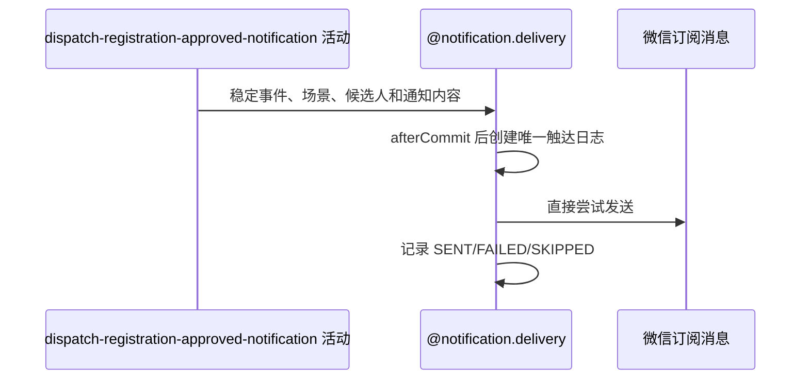

## 概要

审批事务提交后，按是否满员异步触达组团成功或报名成功通知。

## 时序图

## 活动契约

入参包含约球编号、报名编号、获批用户、有效参与者、更新后是否满员及语义化通知内容。触达结果不影响审批。

## 详细流程

1. 更新后满员选择 `TEAM_SUCCESS`，使用本次获批报名编号构造事件，候选是全部有效参与者。
2. 未满员选择 `JOIN_SUCCESS`，使用报名编号构造事件，候选只有获批申请人。
3. 发送前复核成员资格；事件、接收人和渠道唯一键阻止重复触达。
4. 直接调用微信，未订阅记 `SKIPPED`，渠道错误记 `FAILED`，成功记 `SENT`。

## 边界情况

- 满员时不再给获批人单独发报名成功。
- `TEAM_SUCCESS:registrationId` 使同一次审批产生的组团通知对同一用户、同一渠道最多一次；新报名再次触发满员时可形成新事件。
- 事务回滚时 after-commit 任务不执行；通知失败不回滚已提交审批。
