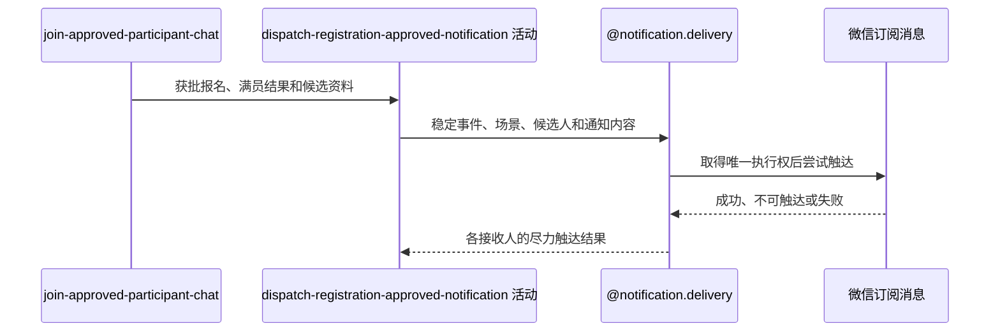

## 概要

审批提交后尽力发送组团成功或报名成功通知。

## 时序图

## 触发条件

待审批报名已改为 `JOINED`、人数已重算且申请人群聊成员已在同一事务提交。

## 活动契约

### 入参

| 字段 | 类型 | 必填 | 约束 |
|---|---|---|---|
| `meetupId` | 字符串 | 是 | 本次审批所属约球编号 |
| `registrationId` | 字符串 | 是 | 本次获批报名编号，用于构造稳定事件 |
| `approvedUserId` | 字符串 | 是 | 未满员时报名成功通知接收人 |
| `participantUserIds` | 字符串列表 | 是 | 满员时提交时点的全部有效参与者，可为空 |
| `fullAfterApproval` | 布尔 | 是 | 为真选择组团成功，否则选择报名成功 |
| `messageContent` | 通知内容 | 是 | 对应场景的约球名称、时间、地点和提示内容 |

### 成功返回

无业务数据；成功只表示已安排一种场景的尽力触达，不表示任何接收人已经收到消息。

## 异常分支

无。接收资格变化、重复事件、渠道不可达、触达日志或微信异常均在活动内跳过或记录，不改变审批结果。

## 领域依赖

### @notification.delivery

- 输入：由获批报名编号构造的稳定事件、约球业务上下文、组团成功或报名成功场景、候选接收人、语义化内容、成员资格过滤器和微信订阅渠道。
- 输出：每个接收人与渠道取得唯一执行权后形成成功、失败或预期跳过的触达结果，重复任务不再次发送；异常时不向审批流程传播失败，保留可审计结果或应用日志。

## 业务动作

- A1 按审批后人数是否达到上限选择唯一通知场景和候选接收人。
- A2 以本次获批报名编号构造稳定事件和对应场景内容。
- A3 在审批及群聊成员事务提交后把通知任务交给异步执行。
- A4 去重候选人并在发送前复核其成员资格。
- A5 委托 `@notification.delivery` 取得微信触达执行权并尝试发送，接受各接收人的触达结果。

## 详细流程

1. A1 审批后人数达到或超过上限时选择 `TEAM_SUCCESS`，候选为全部有效参与者；否则选择 `JOIN_SUCCESS`，候选只有获批申请人，不判断是否首次满员。
2. A2 两种场景都使用本次获批报名编号形成稳定事件，同一次审批不叠加发送两个场景。
3. A3 仅在报名、人数和群聊成员事务成功提交后进入线程池；事务回滚时不启动通知。
4. A4 发送前报名已退出者不建触达日志，资格复核异常按仍可触达继续。
5. A5 只有唯一触达日志首次创建成功才调用微信；缺少接收身份或未订阅时接受预期跳过，其他渠道错误接受失败。

## 边界情况

- 满员时不再给获批人单独发报名成功。
- `TEAM_SUCCESS:registrationId` 使同一次审批产生的组团通知对同一用户、同一渠道最多一次；新报名再次触发满员时可形成新事件。
- 事务回滚时 after-commit 任务不执行；通知失败不回滚已提交审批。

## 实现提示

无
