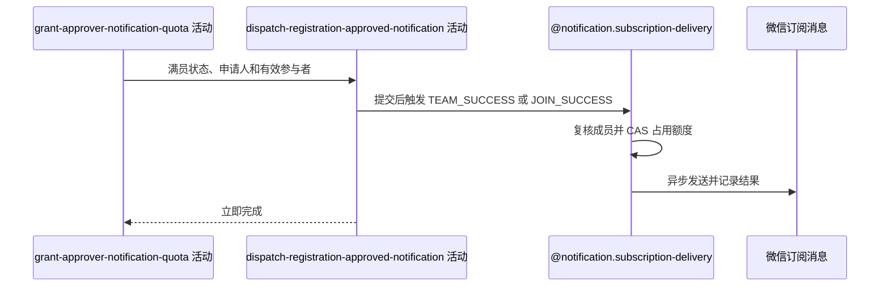

## 概要

在提交后按是否满员异步发送组团成功或报名成功通知。

## 时序图

## 触发条件

审批、群聊及额度登记事务成功提交后执行；根据审批后人数选择唯一场景。

## 活动契约

入参包含 `meetupId`、`applicantId`、有效参与者、更新后是否满员及模板摘要；成功只表示异步任务登记完成。

## 异常分支

无。额度、资格、渠道、发送和回写失败均不影响审批。

## 领域依赖

### @notification.subscription-delivery

- 输入：`MEETUP`、约球、所选场景、候选用户、模板数据和每人消费一条额度的意图
- 输出：提交后至多处理每位候选一条额度并记录结果；失败或跳过不影响审批

## 业务动作

A1 按审批后满员状态选择场景与候选人
A2 提交后查询并占用每用户首条可用额度
A3 复核参与资格、发送模板并记录结果

## 详细流程

1. 更新后 `currentPlayers>=maxPlayers` 时选择 `TEAM_SUCCESS` 给全部 `JOINED/REVIEWED/SKIPPED` 参与者，否则选择 `JOIN_SUCCESS` 只给获批申请人。
2. 没有从未满到满的变化判断；已超员时后续每次审批仍触发 TEAM_SUCCESS。
3. 核心事务提交后异步查询匹配 `UNUSED` 流水，每用户只处理第一条并 CAS 到 `SENDING`。
4. 发送前调用约球成员过滤；明确退出则保留额度跳过，复核异常 fail-open。
5. 通过微信渠道发送活动摘要并回写 `SENT/FAILED`；所有异常只记录，接口不等待。
6. 无通知级幂等键或持久化重试队列。

## 边界情况

- 申请人没有 JOIN_SUCCESS 额度时仍审批成功但收不到通知。
- 满员时不再给申请人发单独报名成功。
- 多次满员触发可能依次消耗参与者多条 TEAM_SUCCESS 额度。
- 提交前回滚不会执行异步任务。

## 实现提示

微信 RPC snapshot 当前缺失；若只允许首次组团成功通知，应把人数状态变化纳入输入契约。
