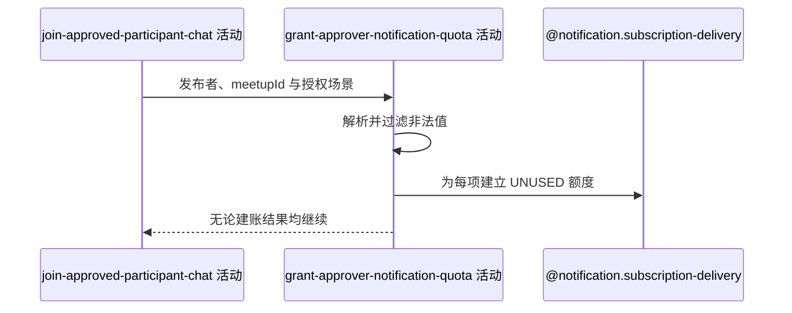

## 概要

按发布者本次可识别授权场景尽力登记后续通知额度。

## 时序图

## 触发条件

审批和群聊成员写入成功后、事务提交前执行；空授权列表可直接完成。

## 活动契约

入参为 `approverId`、`meetupId` 与可选 `acceptedNoticeScenes`；成功不返回建账数量或通知结果。

## 异常分支

无。非法场景忽略，保存异常只记日志，不撤销审批。

## 领域依赖

### @notification.subscription-delivery

- 输入：发布者、`MEETUP`、约球编号、解析场景和逐项建立额度的意图
- 输出：每项建立 `UNUSED` 流水；空输入或失败时跳过/记录且不影响审批

## 业务动作

A1 解析发布者授权场景名
A2 为每个有效元素建立可用额度
A3 吞掉异常并继续提交

## 详细流程

1. 按 `NoticeScene` 枚举名解析，非法项过滤，null/空列表不写。
2. 不限于注释所述 `PENDING_APPROVAL/MEMBER_QUIT`，所有已知约球或赛事场景均可登记；重复项不去重。
3. 每项生成雪花流水，保存发布者、`MEETUP`、约球、场景、模板编号和 `UNUSED` 后批量落库。
4. 异常被服务捕获，只记日志；成功流水随审批事务提交。
5. 本活动不发送消息或验证微信真实授权。

## 边界情况

- 重复场景生成多条额度。
- 审批申请人的授权不会由此补充，额度属于发布者。
- 批量保存失败时审批仍成功。
- 与当前约球无关的已知场景仍可能建账。

## 实现提示

如需收紧，应按入口维护发布者可授权场景白名单；本轮保持尽力型语义。
