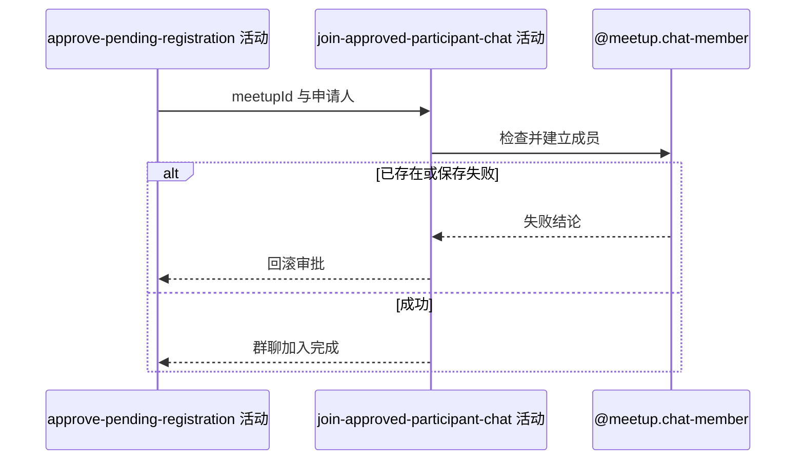

## 概要

为获批申请人建立初始未读数为零的群聊成员关系。

## 时序图

## 触发条件

上游已把目标报名置为 `JOINED` 后、事务提交前执行。

## 活动契约

入参为已审批 `meetupId` 与 `applicantId`；成功不返回业务数据，表示初始聊天成员已建立。

## 异常分支

| 错误标识 | 触发条件 | 来源 |
|---|---|---|
| `ALREADY_JOINED_CHAT` | 同一约球与申请人已有成员 | approve-registration 流程对应错误一行 |
| `SYSTEM_ERROR` | 成员查询、唯一冲突或保存失败 | approve-registration 流程 `SYSTEM_ERROR` 一行 |

## 领域依赖

### @meetup.chat-member

- 输入：约球、获批申请人和建立聊天成员的意图
- 输出：关系不存在时建立雪花编号、未读 0 和当前加入时间；存在或失败时返回相应结论

## 业务动作

A1 检查申请人聊天关系不存在
A2 建立初始聊天成员
A3 确认加入并继续通知编排

## 详细流程

1. 按 `refId+userId` 检查，存在时抛 `ALREADY_JOINED_CHAT`，不复用或按幂等成功。
2. 新成员生成雪花编号，`unreadCount=0`、`joinedAt=当前时间`，已读消息编号和时间为空。
3. 不读取审批前历史消息，因此不会计入初始未读。
4. 并发由 `ref_id+user_id` 唯一键裁决；失败与审批同事务回滚。

## 边界情况

- 先有聊天成员但报名仍 PENDING 时，审批整体失败。
- 已删除旧成员可重新建立。
- 历史消息保留但新成员未读为零。
- 申请人账户是否存在不在本活动校验范围。

## 实现提示

保持审批和成员关系同事务；不要把历史消息自动折算为未读。
