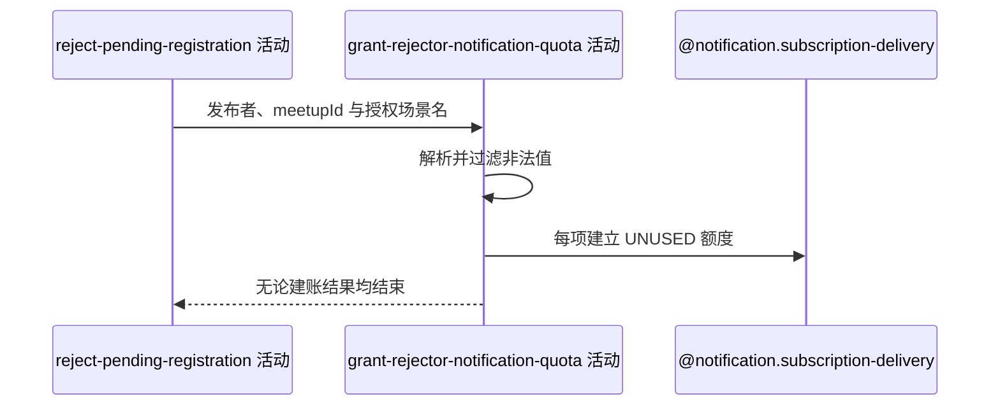

## 概要

按发布者本次可识别授权场景尽力登记后续通知额度。

## 时序图

## 触发条件

目标报名已在当前事务中变为 `REJECTED` 后执行；空授权列表可直接完成。

## 活动契约

入参为 `rejectorId`、`meetupId` 与可选 `acceptedNoticeScenes`；成功不返回实际建账数量。

## 异常分支

无。解析或保存失败只跳过/记日志，不撤销拒绝。

## 领域依赖

### @notification.subscription-delivery

- 输入：发布者、`MEETUP`、约球编号、解析场景和逐项建立可用额度的意图
- 输出：每项建立 `UNUSED` 流水；空输入或失败时返回跳过/失败结论且不影响拒绝

## 业务动作

A1 解析发布者授权场景
A2 为每个有效元素建立通知额度
A3 吞掉异常并提交拒绝事务

## 详细流程

1. 按 `NoticeScene` 枚举名解析，非法项过滤；null、空或全非法列表不写。
2. 当前不限制为注释所述 `PENDING_APPROVAL`，所有已知约球或赛事场景均可登记，重复项不去重。
3. 每项生成雪花流水，保存发布者、`MEETUP`、约球、场景、模板编号和 `UNUSED` 后批量落库。
4. 建账成功随拒绝事务提交；任何异常由通知服务捕获并只记日志，不回滚 `REJECTED`。
5. 本活动不发送拒绝通知或其他消息。

## 边界情况

- 额度属于发布者，不属于被拒绝申请人。
- 重复场景生成多条额度。
- 与当前约球无关的可识别场景仍可建账。
- 批量失败时拒绝接口仍成功。

## 实现提示

若只为下一个申请提醒补额，应显式限制 `PENDING_APPROVAL`；本轮保留当前广泛授权行为。
