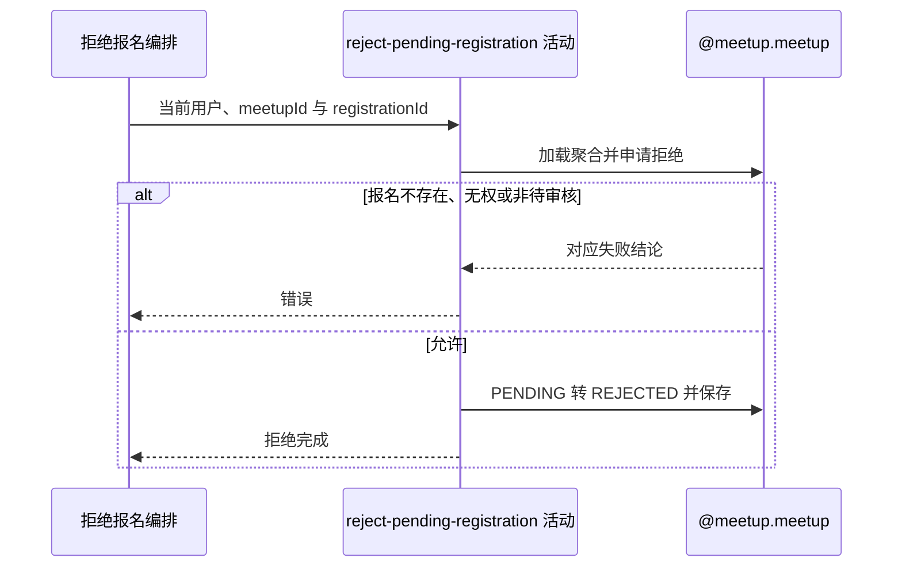

## 概要

校验报名与发布者，将指定待审核报名置为已拒绝并保留历史。

## 时序图

## 触发条件

已登录用户提交非空约球和业务报名编号后执行；不要求约球处于特定阶段。

## 活动契约

入参为 `meetupId`、`registrationId` 和当前 `rejectorId`；成功无业务返回，目标报名历史已保存为 `REJECTED`。

## 异常分支

| 错误标识 | 触发条件 | 来源 |
|---|---|---|
| `MEETUP_NOT_FOUND` | 约球不存在 | reject-registration 流程对应错误一行 |
| `WAITLIST_NOT_FOUND` | 报名不存在或不属于约球 | reject-registration 流程对应错误一行 |
| `NOT_CREATOR` | 当前用户不是发布者 | reject-registration 流程对应错误一行 |
| `WAITLIST_NOT_PENDING` | 报名不是 PENDING | reject-registration 流程对应错误一行 |
| `SYSTEM_ERROR` | 约球、报名读写或事务提交失败 | reject-registration 流程 `SYSTEM_ERROR` 一行 |

## 领域依赖

### @meetup.meetup

- 输入：约球、报名、拒绝人，以及校验归属、创建者权限和待审核状态的意图
- 输出：允许时把目标报名置 `REJECTED` 并保留聚合其他状态；不允许或保存失败时返回相应结论

## 业务动作

A1 加载约球和全部报名并定位目标报名
A2 核实当前用户为发布者且报名仍待审核
A3 把报名置 REJECTED 并整体保存

## 详细流程

1. `A1` 仅在目标约球报名集合中按业务编号查找，其他约球报名视为不存在。
2. `A2` 查到报名后核实当前用户是创建者，再要求报名为 `PENDING`。
3. 不检查约球实际/存储状态、类型、加入方式、容量或 `expiresAt`；`DRAFT/OPEN/ONGOING/FINISHED/CLOSED` 的遗留待审核报名都可拒绝。
4. `A3` 只把状态改为 `REJECTED`，不写 `optTime`，没有拒绝原因字段，不改变人数、约球、群聊与其他报名。

## 边界情况

- 串行重复拒绝因状态不再 PENDING 被拒绝。
- 审批通过、拒绝和撤回并发时无状态版本条件，后提交聚合可能覆盖先提交结果。
- 过期但未自动撤回的 PENDING 仍可拒绝。
- 申请人不会收到拒绝通知。

## 实现提示

若需要审计拒绝时间与理由，应纳入报名行为契约；并发状态转换应改为带原状态条件的单行更新。
