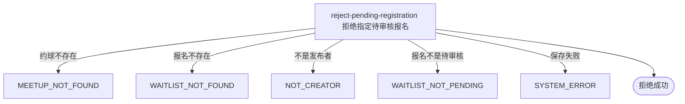

## 概要

由发布者将指定待审核报名拒绝并保留申请历史。

## 触发

约球发布者处理一条待审核报名时发起，调用方是登录用户端。一次请求拒绝一个约球内的一条报名；顺序重复提交在首次成功后因状态不再为 `PENDING` 而拒绝，并发请求没有当前状态版本保护。

## 接口契约

### 请求参数

| 字段 | 类型 | 必填 | 约束 |
|---|---|---|---|
| `meetupId` | 字符串 | 是 | 不可为空白，目标约球编号 |
| `registrationId` | 字符串 | 是 | 不可为空白，目标业务报名编号 |

### 成功响应

无业务数据；成功表示目标报名已变为 `REJECTED`。

## 业务活动

- reject-pending-registration  校验报名与发布者，将指定待审核报名置为已拒绝并保留历史

## 流程图

## 详细流程

1. 识别当前登录用户，读取目标约球及其全部报名记录。
2. 按业务报名编号在该约球聚合中查找申请；先确认报名存在，再确认当前用户是发布者，最后确认报名仍为 `PENDING`。
3. 不检查约球实际或存储状态、加入方式和报名到期时间，因此草稿、开放、进行中、已结束或已关闭约球的遗留待审核报名均可拒绝。
4. 将目标报名状态改为 `REJECTED`；不填写审批操作时间、不接收拒绝原因，不改变当前人数、约球、群聊和其他报名。
5. 整体保存约球聚合；审批通过、拒绝和撤回没有状态版本条件，并发加载同一待审核报名时可能由后提交覆盖先提交结果。
6. 返回拒绝成功，不通知申请人，也不交付报名详情、拒绝时间或理由。

## 异常分支

| 对外失败码 | 触发条件 | 由哪个活动报出 | 补偿动作或超时处理 | 对外提示 |
|---|---|---|---|---|
| 请求校验失败 | 约球编号或报名编号为空白 | 流程 | 不修改报名 | 活动id或报名ID不能为空 |
| `MEETUP_NOT_FOUND` | 目标约球不存在 | reject-pending-registration | 不修改报名 | 约球不存在 |
| `WAITLIST_NOT_FOUND` | 报名编号不存在或不属于目标约球 | reject-pending-registration | 不修改该约球下任何报名 | 报名记录不存在 |
| `NOT_CREATOR` | 当前用户不是约球发布者 | reject-pending-registration | 不修改报名 | 仅发布者可操作 |
| `WAITLIST_NOT_PENDING` | 目标报名不再为 `PENDING` | reject-pending-registration | 保留当前报名状态 | 该报名当前状态不可撤回 |

约球状态、加入方式和报名到期时间不影响拒绝。并发通过、拒绝或撤回可能覆盖同一报名状态。本流程不接收订阅相关字段、不登记订阅信息，也不发送拒绝通知。

## 技术线索

- HTTP 接口：`POST /meetup/registration/reject`
- 报名状态：`PENDING` → `REJECTED`
- `opt_time` 当前不写入
