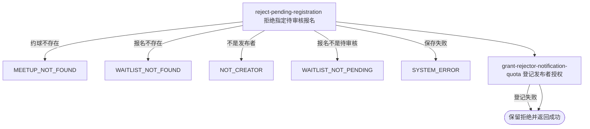

## 概要

由发布者将指定待审核报名拒绝并保留申请历史。

## 触发

约球发布者处理一条待审核报名时发起，调用方是登录用户端。一次请求拒绝一个约球内的一条报名；顺序重复提交在首次成功后因状态不再为 `PENDING` 而拒绝，并发请求没有当前状态版本保护。

## 接口契约

### 请求参数

| 字段 | 类型 | 必填 | 约束 |
|---|---|---|---|
| `meetupId` | 字符串 | 是 | 不可为空白，目标约球编号 |
| `registrationId` | 字符串 | 是 | 不可为空白，目标业务报名编号 |
| `acceptedNoticeScenes` | 字符串列表 | 否 | 发布者本次授权场景；非法项忽略，重复项不去重 |

### 成功响应

无业务数据；成功表示报名已保存为 `REJECTED`。接口不交付申请人、报名详情、拒绝时间、拒绝原因或授权登记结果。

## 业务活动

- reject-pending-registration  校验报名与发布者，将指定待审核报名置为已拒绝并保留历史
- grant-rejector-notification-quota  按发布者本次可识别授权场景尽力登记后续通知额度

## 流程图

## 详细流程

1. 接收约球、报名和发布者本次通知授权场景，识别当前登录用户并读取约球及全部报名。
2. 按业务报名编号在该约球聚合中查找申请；先确认报名存在，再确认当前用户是发布者，最后确认报名仍为 `PENDING`。
3. 不检查约球实际或存储状态、加入方式和报名到期时间，因此草稿、开放、进行中、已结束或已关闭约球的遗留待审核报名均可拒绝。
4. 将目标报名状态改为 `REJECTED`；不填写审批操作时间、不接收拒绝原因，不改变当前人数、约球、群聊和其他报名。
5. 整体保存约球聚合；审批通过、拒绝和撤回没有状态版本条件，并发加载同一待审核报名时可能由后提交覆盖先提交结果。
6. 解析并尝试登记发布者本次通知授权场景；所有已知约球或赛事场景均可登记，非法项忽略、重复不去重，登记失败不撤销拒绝。
7. 返回拒绝成功，不通知申请人，也不交付报名详情、拒绝时间、理由或授权结果。

## 异常分支

| 对外失败码 | 触发条件 | 由哪个活动报出 | 补偿动作或超时处理 | 对外提示 |
|---|---|---|---|---|
| 请求校验失败 | 约球编号或报名编号为空白 | 流程 | 不修改报名 | 活动id或报名ID不能为空 |
| `MEETUP_NOT_FOUND` | 目标约球不存在 | reject-pending-registration | 不修改报名 | 约球不存在 |
| `WAITLIST_NOT_FOUND` | 报名编号不存在或不属于目标约球 | reject-pending-registration | 不修改该约球下任何报名 | 报名记录不存在 |
| `NOT_CREATOR` | 当前用户不是约球发布者 | reject-pending-registration | 不修改报名 | 仅发布者可操作 |
| `WAITLIST_NOT_PENDING` | 目标报名不再为 `PENDING` | reject-pending-registration | 保留当前报名状态 | 该报名当前状态不可撤回 |
| `SYSTEM_ERROR` | 约球、报名读写或事务提交失败 | reject-pending-registration | 事务回滚本次状态修改，不登记授权 | 系统异常，请稍后重试 |

约球状态、加入方式和报名到期时间不影响拒绝。并发通过、拒绝或撤回可能覆盖同一报名状态。授权解析或登记失败被吞掉并记录日志，不改变 `REJECTED`；本流程不发送拒绝通知。

## 技术线索

- HTTP 接口：`POST /meetup/registration/reject`
- 报名状态：`PENDING` → `REJECTED`
- `opt_time` 当前不写入
- `acceptedNoticeScenes` 用于补充发布者后续通知额度
