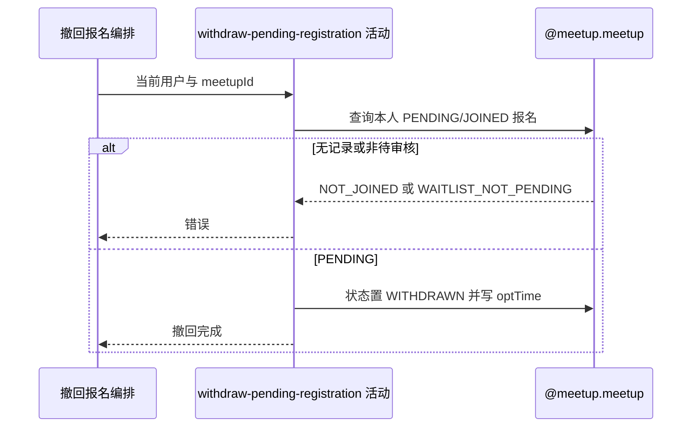

## 概要

查找本人活动报名，将待审核申请改为已撤回并记录操作时间。

## 时序图

## 触发条件

已登录用户提交非空约球编号后执行；不加载或核实约球主记录。

## 活动契约

入参为 `meetupId` 与当前 `userId`；成功无业务返回，本人待审核报名已置 `WITHDRAWN` 并写当前操作时间。

## 异常分支

| 错误标识 | 触发条件 | 来源 |
|---|---|---|
| `NOT_JOINED` | 没有本人 PENDING 或 JOINED 报名 | withdraw-registration 流程对应错误一行 |
| `WAITLIST_NOT_PENDING` | 查询到 JOINED 报名 | withdraw-registration 流程对应错误一行 |
| `SYSTEM_ERROR` | 查询返回多条、二次读取、更新或事务提交失败 | withdraw-registration 流程 `SYSTEM_ERROR` 一行 |

## 领域依赖

### @meetup.meetup

- 输入：约球编号、当前用户与撤回本人待审核报名的意图
- 输出：存在唯一 `PENDING` 时置 `WITHDRAWN` 并记录操作时间；无活动报名、已加入、多条冲突或更新失败时返回相应结论

## 业务动作

A1 按约球和本人查询活动报名
A2 确认报名仍为 PENDING
A3 按业务报名编号更新为 WITHDRAWN 并写操作时间

## 详细流程

1. `A1` 直接查询 `rally_meetup_id+user_id` 且状态为大写 `PENDING/JOINED` 的唯一报名，不读取约球主表。
2. 没有记录时报 `NOT_JOINED`；多于一条时唯一结果查询失败。`REJECTED/WITHDRAWN/QUIT/REVIEWED/SKIPPED` 历史不参与。
3. `A2` 只有 `PENDING` 可继续；`JOINED` 报 `WAITLIST_NOT_PENDING`，不检查约球状态、时间、加入方式或 `expiresAt`。
4. `A3` 再按业务报名编号读取持久化记录，设置 `status=WITHDRAWN`、`optTime=当前时间`，按自增主键更新。
5. 更新不附原状态条件或版本；不修改约球人数、群聊和通知数据，也不通知发布者。

## 边界情况

- 成功后重复撤回找不到活动报名并报 NOT_JOINED。
- 约球主记录不存在但报名残留时仍可撤回。
- 同一用户约球有多条 PENDING/JOINED 时查询失败。
- 与通过或拒绝并发时，二次更新可能覆盖对方已写状态。

## 实现提示

领域契约当前复用 `@meetup.meetup` 的报名边界；并发治理应使用 `WHERE biz_id=? AND status='PENDING'` 的条件更新并检查影响行数。
