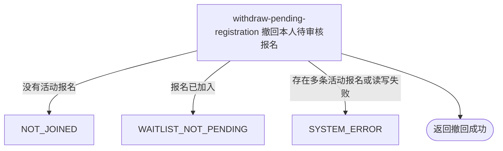

## 概要

让申请人撤回本人仍待审核的约球报名。

## 触发

待审核申请人在发布者审批前主动取消申请时发起，调用方是登录用户端。一次请求处理当前用户在一个约球下的报名；成功后重复提交找不到活动报名并按未报名拒绝，并发审批没有状态版本保护。

## 接口契约

### 请求参数

| 字段 | 类型 | 必填 | 约束 |
|---|---|---|---|
| `meetupId` | 字符串 | 是 | 不可为空白，用于定位本人活动报名；不核实约球对象 |

### 成功响应

无业务数据；成功表示本人待审核报名已改为 `WITHDRAWN` 并记录操作时间。接口不交付报名编号、状态、时间或约球详情。

## 业务活动

- withdraw-pending-registration  查找本人活动报名，将待审核申请改为已撤回并记录操作时间

## 流程图

## 详细流程

1. 接收非空约球编号并识别当前登录用户；本流程不先读取或核实约球对象。
2. 按约球和本人用户编号查询状态为大写 `PENDING` 或 `JOINED` 的报名；没有记录时按未报名拒绝，多于一条时唯一结果查询失败。
3. 查询到 `JOINED` 时按不可撤回拒绝；只有 `PENDING` 可以继续，约球状态、时间、报名到期时间和加入方式均不参与判断。
4. 按业务报名编号读取记录，将状态改为 `WITHDRAWN`，同时把操作时间写为当前时刻；保留申请、约球人数、群聊和通知资料。
5. 更新语句不带原状态条件或版本号；与审批通过、拒绝并发时可能覆盖对方结果，最终由写入顺序决定。
6. 返回撤回成功，不通知发布者，也不交付报名编号、状态、操作时间或约球详情。

## 异常分支

| 对外失败码 | 触发条件 | 由哪个活动报出 | 补偿动作或超时处理 | 对外提示 |
|---|---|---|---|---|
| 请求校验失败 | `meetupId` 为空白 | 流程 | 不查询或修改报名 | meetupId: 约球ID不能为空 |
| `NOT_JOINED` | 指定约球下不存在本人 `PENDING` 或 `JOINED` 报名 | withdraw-pending-registration | 保留全部历史报名 | 你未报名该约球 |
| `WAITLIST_NOT_PENDING` | 查询到的本人报名已经是 `JOINED` | withdraw-pending-registration | 保持已加入关系不变 | 该报名当前状态不可撤回 |
| `SYSTEM_ERROR` | 同一用户约球存在多条 `PENDING`/`JOINED`，报名二次读取、更新或事务提交失败 | withdraw-pending-registration | 事务回滚状态和操作时间修改 | 系统异常，请稍后重试 |

本流程不读取约球，因此无“约球不存在”分支。更新不附原状态条件，与审批通过或拒绝并发时可能互相覆盖。已拒绝、已撤回、已退出、已评价和已跳过的历史报名不参与查询。

## 技术线索

- HTTP 接口：`POST /meetup/registration/withdraw`
- 查询状态：大写 `PENDING`、`JOINED`
- 状态变更：`PENDING` → `WITHDRAWN`
- 操作时间：写入 `opt_time`
- 更新定位：业务报名编号二次读取后按数据库自增主键更新
