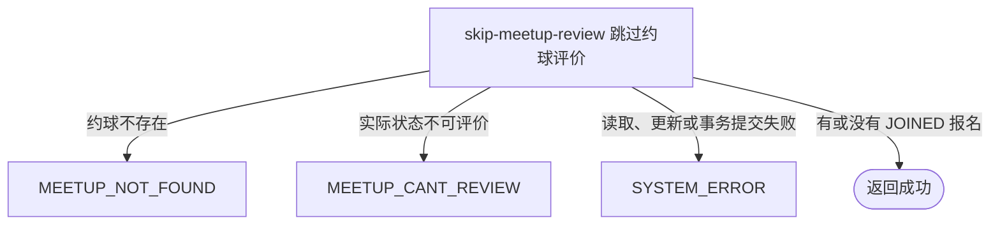

## 概要

将本人仍为已加入的约球报名标记为已跳过评价。

## 触发

登录用户决定不再提交指定约球的赛后评价时发起。一次请求只指定一个约球，但底层会批量处理本人在该约球下所有仍为 `JOINED` 的报名；无可更新报名和重复操作也返回成功。

## 接口契约

### 请求参数

| 字段 | 类型 | 必填 | 约束 |
|---|---|---|---|
| `meetupId` | 字符串 | 是 | 不可为空白；目标约球必须存在且实际处于进行中或已结束 |

### 成功响应

无业务数据；成功只表示跳过请求已执行，不保证存在报名或发生状态变更。接口不交付实际影响数量、报名新状态、操作时间、评价或复盘详情。

## 业务活动

- skip-meetup-review  校验约球可评价状态，将本人全部仍为已加入的报名批量标记为已跳过

## 流程图

## 详细流程

1. 接收非空约球编号，识别当前登录用户并读取约球及全部报名。
2. 只确认约球实际状态为进行中或已结束；不校验当前用户是否发布者、有效参与者或存在任何报名，也不读取评价截止期配置。
3. 按当前用户、约球和状态严格为 `JOINED` 的条件批量更新报名，将所有命中记录改为 `SKIPPED` 并写当前操作时间。
4. 本人没有报名，或报名为 `PENDING`、`REJECTED`、`WITHDRAWN`、`QUIT`、`REVIEWED`、`SKIPPED` 时更新零条但仍成功；多个重复 `JOINED` 报名会全部更新。
5. 已保存的部分或全部评价保留，不新增、删除或作废评价与比分，也不改变约球和个人档案。
6. 返回跳过成功，不交付实际影响数量、报名新状态、操作时间或复盘详情。

## 异常分支

| 对外失败码 | 触发条件 | 由哪个活动报出 | 补偿动作或超时处理 | 对外提示 |
|---|---|---|---|---|
| 请求校验失败 | `meetupId` 为空白 | 流程 | 不读取约球或修改报名 | meetupId 不能为空 |
| `MEETUP_NOT_FOUND` | 指定约球不存在 | skip-meetup-review | 不修改报名和评价 | 约球不存在 |
| `MEETUP_CANT_REVIEW` | 约球实际状态不是 `ONGOING` 或 `FINISHED` | skip-meetup-review | 保持全部报名和评价不变 | 约球不可评价 |
| `SYSTEM_ERROR` | 约球读取、报名批量更新或事务提交发生未归类异常 | skip-meetup-review | 事务回滚本次报名状态和操作时间修改 | 系统异常，请稍后重试 |

本人没有报名，或报名为 `PENDING`、`REJECTED`、`WITHDRAWN`、`QUIT`、`REVIEWED`、`SKIPPED` 时不是异常：更新零条并返回成功。当前实现不校验参与资格、不读取评价期限，也不以受影响行数判断成功。

## 技术线索

- HTTP 接口：`POST /recap/review/skip`
- 可评价实际状态：`ONGOING`、`FINISHED`
- 更新条件：当前用户编号、约球编号、状态严格为 `JOINED`
- 状态变更：`JOINED` → `SKIPPED`
- 操作时间：写入 `opt_time`
- 批量语义：重复 `JOINED` 报名全部更新；零行更新也正常返回
- 未使用配置：`review.deadline_days`
