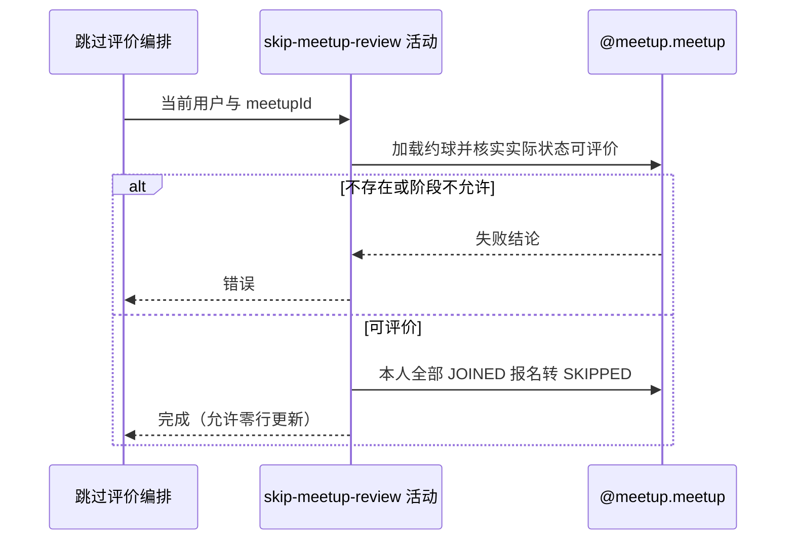

## 概要

校验约球可评价状态，将本人全部仍为已加入的报名批量标记为已跳过。

## 时序图

## 触发条件

已登录用户提交非空约球编号后执行；不要求用户具有该约球报名。

## 活动契约

入参为 `meetupId` 和当前 `userId`；成功无业务返回，可能更新一条、多条或零条报名。

## 异常分支

| 错误标识 | 触发条件 | 来源 |
|---|---|---|
| `MEETUP_NOT_FOUND` | 约球不存在 | skip-meetup-review 流程对应错误一行 |
| `MEETUP_CANT_REVIEW` | 实际状态不是 ONGOING/FINISHED | skip-meetup-review 流程对应错误一行 |
| `SYSTEM_ERROR` | 约球读取、报名更新或事务提交失败 | skip-meetup-review 流程 `SYSTEM_ERROR` 一行 |

## 领域依赖

### @meetup.meetup

- 输入：约球、当前用户，以及核实评价阶段并跳过本人评价的意图
- 输出：约球为 `ONGOING/FINISHED` 时把本人全部 `JOINED` 报名转 `SKIPPED` 并写操作时间；约球不存在、阶段不允许或更新失败时返回相应结论

## 业务动作

A1 加载约球和报名并计算实际状态
A2 确认实际状态允许评价
A3 批量把本人 JOINED 报名置 SKIPPED 并写操作时间

## 详细流程

1. `A1-A2` 按开始、结束时间对 `OPEN` 懒计算状态，只允许 `ONGOING/FINISHED`；其他存储状态若枚举本身是 FINISHED 也允许。
2. 不校验当前用户是发布者、参与者或存在报名，也不读取 `review.deadline_days`，因此超过评价期限仍可跳过。
3. `A3` 以 `userId+meetupId+status=JOINED` 批量更新为 `SKIPPED`，同时写 `optTime=当前时间`。
4. 更新零行仍成功；多条重复 JOINED 报名全部更新，不检查影响行数。
5. `PENDING/REJECTED/WITHDRAWN/QUIT/REVIEWED/SKIPPED` 保持不变；已有评价、比分、约球与用户档案也不修改。

## 边界情况

- 无报名的任意登录用户可对可评价约球调用并得到成功。
- 重复跳过更新零行并成功。
- 超过正常评价截止期限仍可跳过。
- 重复 JOINED 报名会一起转为 SKIPPED。

## 实现提示

若跳过也受参与资格与截止期约束，应与提交评价共用 `assertReviewAvailable`；本轮保留当前宽松行为。
