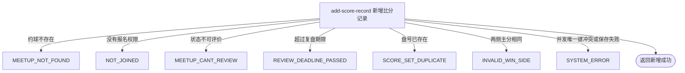

## 概要

为当前用户可复盘的约球新增一盘唯一比分，并保存球员资料快照与胜方。

## 触发

约球发布者或被当前报名查询识别为已报名的登录用户，在一场进行中或结束后仍处于复盘期限内的约球中提交一盘比分时发起。一次请求新增一个盘号；同场同盘不可重复，接口不代替比分查询。

## 接口契约

### 请求参数

| 字段 | 类型 | 必填 | 约束 |
|---|---|---|---|
| `meetupId` | 字符串 | 是 | 不可为空白；约球必须存在、可复盘且未超过截止时刻 |
| `setNum` | 整数 | 是 | 同一约球内唯一；未校验正数、从 1 开始或连续递增 |
| `setFormatType` | 枚举 | 是 | `GAME` 或 `TIEBREAK`；不据此校验比分规则 |
| `matchType` | 枚举 | 是 | `SINGLE`、`DOUBLE` 或 `RALLY`；不核对约球类型与阵容结构 |
| `sideAPlayer1` | 字符串 | 是 | 不可为空白；不核实用户存在或参与资格 |
| `sideAPlayer2` | 字符串 | 否 | 可空；不因比赛类型强制填写或禁止填写 |
| `sideBPlayer1` | 字符串 | 是 | 不可为空白；不核实用户存在或参与资格 |
| `sideBPlayer2` | 字符串 | 否 | 可空；不因比赛类型强制填写或禁止填写 |
| `sideAScore` | 整数 | 是 | 必须与 B 侧主分不同；无范围和计分合法性校验 |
| `sideBScore` | 整数 | 是 | 必须与 A 侧主分不同；无范围和计分合法性校验 |
| `sideATiebreakScore` | 整数 | 否 | 可独立为空或填写；不参与胜方计算 |
| `sideBTiebreakScore` | 整数 | 否 | 可独立为空或填写；不参与胜方计算 |

### 成功响应

无业务数据；成功表示一盘比分已保存。接口不返回新比分的业务编号、初始版本、胜方或完整内容，调用方需另行查询。

## 业务活动

- add-score-record  校验记录权限与复盘窗口，生成并保存同场同盘唯一的比分记录和球员资料快照

## 流程图

## 详细流程

1. 接收约球、盘号、比赛类型、盘制、双方球员和比分，识别当前登录用户并读取约球及全部报名。
2. 确认当前用户是发布者，或存在首条状态为 `PENDING`、`JOINED`、`REVIEWED`、`SKIPPED` 的报名；确认约球实际状态为进行中或已结束，且当前时刻不晚于约球结束时间加复盘期限。
3. 按约球和盘号查询已有比分；已有任意一条相同盘号记录时拒绝新增，不比较比赛类型、阵容或记录人。
4. 不校验盘号正数或连续性、阵容人数和参与资格、重复球员、比分范围及抢七字段组合；只要求两侧主分不相等，并据其大小确定胜方，抢七分不参与胜负判断。
5. 生成比分业务编号，记录约球开始时间、提交人为记录人，并批量查询非空且去重后的球员编号；查到档案的球员保存昵称、头像和性别快照，查不到的球员仍可保存为空快照。
6. 保存一盘比分；数据库按约球和盘号保持唯一，并发同盘请求可能在预检后以唯一键冲突失败。本流程不改变约球、报名和个人评分。
7. 返回成功但无业务数据，不交付比分业务编号、版本或完整比分内容。

## 异常分支

| 对外失败码 | 触发条件 | 由哪个活动报出 | 补偿动作或超时处理 | 对外提示 |
|---|---|---|---|---|
| 请求校验失败 | 任一必填字段为空；枚举值无法转换 | 流程 | 不读取或保存比分 | 使用对应字段的不能为空提示；无法识别的值按请求或系统异常处理 |
| `MEETUP_NOT_FOUND` | 指定约球不存在 | add-score-record | 不建立比分 | 约球不存在 |
| `NOT_JOINED` | 当前用户不是发布者，且找不到首条 `PENDING`、`JOINED`、`REVIEWED`、`SKIPPED` 报名 | add-score-record | 不建立比分 | 你未报名该约球 |
| `MEETUP_CANT_REVIEW` | 约球实际状态不是 `ONGOING` 或 `FINISHED` | add-score-record | 不建立比分 | 约球不可评价 |
| `REVIEW_DEADLINE_PASSED` | 当前时刻晚于约球结束时间加 `review.deadline_days` | add-score-record | 不建立比分 | 评价已超期 |
| `SCORE_SET_DUPLICATE` | 查到同一约球已有相同盘号 | add-score-record | 保留原比分，不覆盖 | 盘号重复 |
| `INVALID_WIN_SIDE` | A、B 两侧主分相同，无法按大小确定胜方 | add-score-record | 不建立比分 | 获胜边无效 |
| `SYSTEM_ERROR` | 球员资料读取、比分保存失败，或并发同盘写入触发数据库唯一键冲突 | add-score-record | 本次插入失败；先成功的并发记录保留 | 系统异常，请稍后重试 |

球员不存在、档案缺失、阵容不符合比赛类型、球员不是参与者、比分为负数或不符合网球计分、抢七分缺一侧均不会触发业务拒绝；当前实现按原值继续保存。

## 技术线索

- HTTP 接口：`POST /recap/score/add`
- 记录表：`rally_meetup_score`
- 业务编号：雪花算法字符串
- 复盘窗口：约球实际状态为 `ONGOING` 或 `FINISHED`，截止时刻为 `end_time + review.deadline_days`
- 权限查询：发布者直接通过；非发布者取首条 `PENDING`、`JOINED`、`REVIEWED`、`SKIPPED` 报名
- 唯一约束：`uk_meetup_set (rally_meetup_id, set_number)`
- 初始版本：数据库默认 `0`
- 胜方计算：仅比较 `side_a_score` 与 `side_b_score`
- 快照字段：球员昵称、头像、性别；比赛日期取约球 `start_time`
