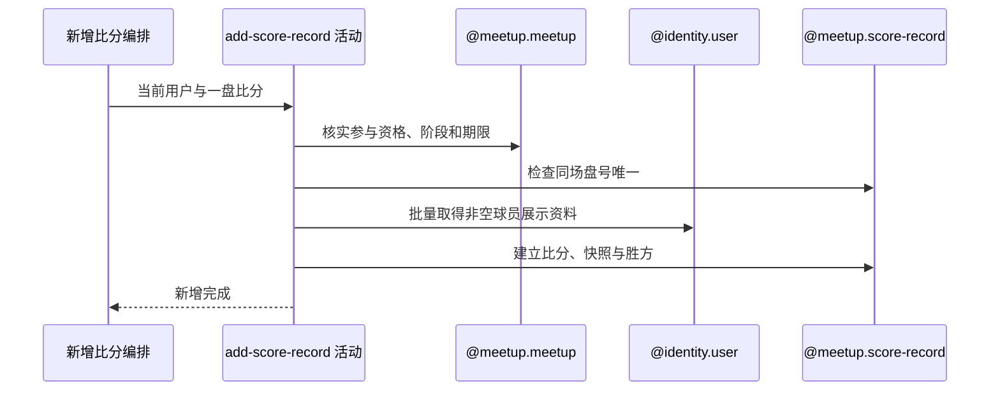

## 概要

校验记录权限与复盘窗口，生成并保存同场同盘唯一的比分记录和球员资料快照。

## 时序图

## 触发条件

已登录用户提交通过必填与枚举校验的一盘比分后执行。

## 活动契约

入参包含 `meetupId`、盘号、盘制、比赛类型、双方一号必填/二号可选球员、主分和可选抢七分；成功无业务返回。

## 异常分支

| 错误标识 | 触发条件 | 来源 |
|---|---|---|
| `MEETUP_NOT_FOUND` | 约球不存在 | add-score-record 流程对应错误一行 |
| `NOT_JOINED` | 当前用户不是创建者且无待审核或有效报名 | add-score-record 流程对应错误一行 |
| `MEETUP_CANT_REVIEW` | 实际状态非 ONGOING/FINISHED | add-score-record 流程对应错误一行 |
| `REVIEW_DEADLINE_PASSED` | 超过结束时间加评价期限 | add-score-record 流程对应错误一行 |
| `SCORE_SET_DUPLICATE` | 同约球盘号已存在 | add-score-record 流程对应错误一行 |
| `INVALID_WIN_SIDE` | 两侧主分相等 | add-score-record 流程对应错误一行 |
| `SYSTEM_ERROR` | 用户资料、比分保存或并发唯一冲突 | add-score-record 流程 `SYSTEM_ERROR` 一行 |

## 领域依赖

### @meetup.meetup

- 输入：约球、记录人，以及核实参与资格、复盘阶段和期限的意图
- 输出：返回约球开始时间和可记录结论；不存在、无资格、阶段或期限不允许时返回相应结论

### @identity.user

- 输入：双方非空且去重后的球员编号与取得昵称、头像、性别快照的意图
- 输出：返回存在用户的展示资料；缺失用户被省略而不阻断比分建立

### @meetup.score-record

- 输入：约球、盘号、阵容、比分、记录人、资料快照及建立唯一比分的意图
- 输出：同场盘号不存在时生成雪花记录并保存胜方；重复、平分或保存失败时返回相应结论

## 业务动作

A1 核实记录人资格与复盘窗口
A2 检查同一约球盘号不存在
A3 校验两侧主分并确定胜方
A4 批量补充球员展示资料快照
A5 生成业务编号并保存比分记录

## 详细流程

1. `A1` 当前用户是发布者，或具有 `PENDING/JOINED/REVIEWED/SKIPPED` 报名即可；实际状态须 `ONGOING/FINISHED` 且不晚于 `endTime+review.deadline_days`。
2. `A2` 只按 `meetupId+setNum` 检查已有记录，不比较盘制、类型、阵容或记录人；盘号不要求正数、从 1 开始或连续。
3. 不核对 matchType 与约球、单双打阵容、球员存在/参与资格、重复球员、分数范围、网球计分或抢七字段配对。
4. `A3` 只比较 `sideAScore/sideBScore`，相等拒绝，较大一侧为胜方；抢七分不参与胜方计算。
5. `A4` 对四个球员编号过滤空白并去重后批量查用户；命中保存昵称、头像键和性别，缺失用户对应快照为空仍继续。
6. `A5` 生成雪花比分编号，记录约球开始时间、提交人为 `recordedBy` 及所有原始比分字段；初始版本由数据库默认 0。
7. 数据库再以 `meetupId+setNumber` 唯一约束兜底；并发同盘预检都通过时一个插入可能失败。本活动不触发实际评分重算，只有 TODO。

## 边界情况

- 负盘号、负分或明显不合法网球比分仍可保存。
- SINGLE 可填写二号球员，DOUBLE/RALLY 可不填二号球员。
- 不存在或非参与者球员仍可进入记录，快照为空。
- 并发同盘不是幂等，一个成功、另一个系统失败。

## 实现提示

领域依赖仅登记、未设计 `@meetup.score-record`；若补强规则，应统一在比分聚合校验盘号、阵容与计分，不依赖前端。
