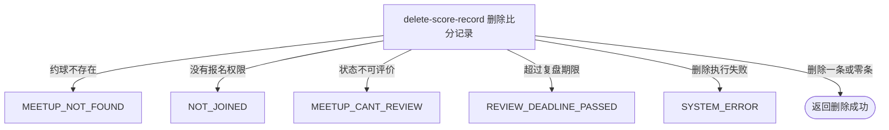

## 概要

在约球复盘窗口内直接移除指定业务编号的一盘比分。

## 触发

约球发布者或被当前报名查询识别为已报名的登录用户，在约球进行中或结束后的复盘期限内请求删除一盘比分时发起。一次请求按约球编号和比分业务编号共同定位；重复删除具有相同成功响应。

## 接口契约

### 请求参数

| 字段 | 类型 | 必填 | 约束 |
|---|---|---|---|
| `meetupId` | 字符串 | 是 | 不可为空白；约球必须存在、可复盘且未超过截止时刻 |
| `bizId` | 字符串 | 是 | 不可为空白；与约球编号共同定位比分，不校验格式和版本 |

### 成功响应

无业务数据；成功表示删除命令已执行，不保证目标比分此前存在或实际删除一条记录。接口不交付受影响数量、删除前内容或审计信息。

## 业务活动

- delete-score-record  校验约球操作资格和复盘窗口，按约球与比分业务编号物理删除记录

## 流程图

## 详细流程

1. 接收非空约球编号和比分业务编号，识别当前登录用户并读取约球及全部报名。
2. 确认当前用户是发布者，或存在首条状态为 `PENDING`、`JOINED`、`REVIEWED`、`SKIPPED` 的报名；确认约球实际状态为进行中或已结束，且当前时刻不晚于结束时间加复盘期限。
3. 不预读目标比分，也不校验比分记录人、阵容成员、版本或盘号；按约球编号与比分业务编号共同执行物理删除。
4. 指定比分不存在或归属其他约球时删除零条但仍成功；满足约球权限的用户可删除该约球下任何人记录的比分。
5. 删除不保留删除人、时间、原因、历史值或恢复状态，不修改约球、报名、评价和个人档案，也不执行代码中仅注释占位的评分重算。
6. 返回成功但无业务数据，不交付受影响数量或删除前比分内容。

## 异常分支

| 对外失败码 | 触发条件 | 由哪个活动报出 | 补偿动作或超时处理 | 对外提示 |
|---|---|---|---|---|
| 请求校验失败 | `meetupId` 为空白，或 `bizId` 为空白 | 流程 | 不读取约球或删除比分 | 约球ID不能为空；比分记录ID不能为空 |
| `MEETUP_NOT_FOUND` | 指定约球不存在 | delete-score-record | 不删除比分 | 约球不存在 |
| `NOT_JOINED` | 当前用户不是发布者，且找不到首条 `PENDING`、`JOINED`、`REVIEWED`、`SKIPPED` 报名 | delete-score-record | 不删除比分 | 你未报名该约球 |
| `MEETUP_CANT_REVIEW` | 约球实际状态不是 `ONGOING` 或 `FINISHED` | delete-score-record | 不删除比分 | 约球不可评价 |
| `REVIEW_DEADLINE_PASSED` | 当前时刻晚于约球结束时间加 `review.deadline_days` | delete-score-record | 不删除比分 | 评价已超期 |
| `SYSTEM_ERROR` | 数据库删除执行失败或发生未归类异常 | delete-score-record | 数据库语句失败时不形成删除；调用方需重新查询确认 | 系统异常，请稍后重试 |

比分不存在、归属其他约球或已被删除不是异常：共同条件命中零条，接口仍返回成功。当前实现不区分“删除成功一条”和“无需删除”。

## 技术线索

- HTTP 接口：`POST /recap/score/delete`
- 记录表：`rally_meetup_score`
- 删除条件：`rally_meetup_id = meetupId` 且 `biz_id = bizId`
- 删除方式：物理删除，不先读记录、不检查版本、不保留墓碑
- 复盘窗口：约球实际状态为 `ONGOING` 或 `FINISHED`，截止时刻为 `end_time + review.deadline_days`
- 权限查询：发布者直接通过；非发布者取首条 `PENDING`、`JOINED`、`REVIEWED`、`SKIPPED` 报名
- 配置降级：评价期限缺失时使用枚举默认值，无法解析时按 `0` 天
- 未实现事项：评分重算仅有 `TODO` 注释
