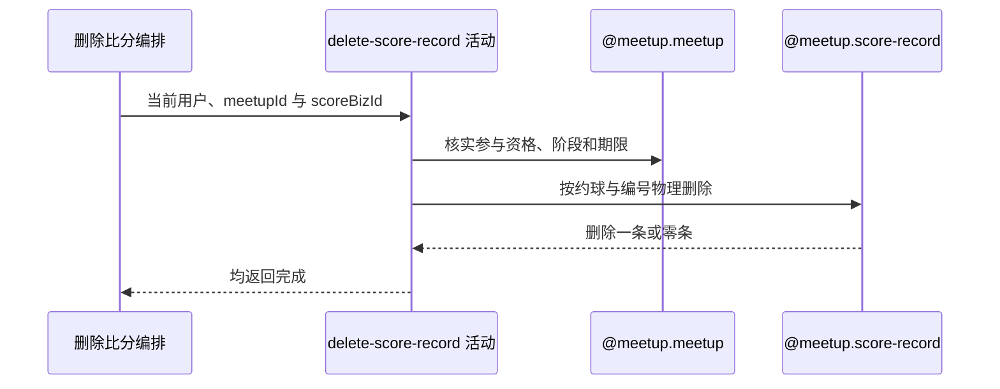

## 概要

校验约球操作资格和复盘窗口，按约球与比分业务编号物理删除记录。

## 时序图

## 触发条件

已登录用户提交非空约球和比分业务编号后执行。

## 活动契约

入参为 `meetupId`、`scoreBizId` 与当前 `userId`；成功无业务返回，不保证目标此前存在或确实删除一条。

## 异常分支

| 错误标识 | 触发条件 | 来源 |
|---|---|---|
| `MEETUP_NOT_FOUND` | 约球不存在 | delete-score-record 流程对应错误一行 |
| `NOT_JOINED` | 非创建者且无待审核或有效报名 | delete-score-record 流程对应错误一行 |
| `MEETUP_CANT_REVIEW` | 实际状态非 ONGOING/FINISHED | delete-score-record 流程对应错误一行 |
| `REVIEW_DEADLINE_PASSED` | 超过复盘期限 | delete-score-record 流程对应错误一行 |
| `SYSTEM_ERROR` | 删除执行或事务提交失败 | delete-score-record 流程 `SYSTEM_ERROR` 一行 |

## 领域依赖

### @meetup.meetup

- 输入：约球、操作人，以及核实参与资格、复盘阶段和期限的意图
- 输出：允许时返回操作上下文；不存在、无资格、阶段或期限不允许时返回相应结论

### @meetup.score-record

- 输入：约球编号、比分业务编号和物理删除意图
- 输出：删除共同条件命中的记录；零行也返回完成，执行失败时返回失败结论

## 业务动作

A1 核实操作人资格与复盘窗口
A2 按约球和比分业务编号执行物理删除
A3 无论一条或零条均确认完成

## 详细流程

1. `A1` 发布者或具有 `PENDING/JOINED/REVIEWED/SKIPPED` 报名可操作；约球实际状态须 `ONGOING/FINISHED` 且未超过 `endTime+review.deadline_days`。
2. `A2` 不预读目标比分，不校验记录人、球员阵容、版本或盘号；满足约球权限的用户可删除本约球任何人记录的比分。
3. 物理删除条件是 `rallyMeetupId=meetupId AND bizId=scoreBizId`，不保留删除人、时间、原因、旧值或墓碑。
4. 目标不存在、已删除或属于其他约球时命中零条，仍返回成功且不交付影响行数。
5. 不修改约球、报名、评价或用户档案；评分重算仍只是 TODO。

## 边界情况

- 重复删除具有相同成功响应。
- 同约球任一有复盘资格用户可删除他人记录的比分。
- 删除与更新并发时无统一版本裁决，结果取决于数据库执行顺序。
- 零行成功使调用方必须重新查询确认当前状态。

## 实现提示

领域依赖复用未设计的 `@meetup.score-record`；如需审计或限定记录人，应改为先取得记录并在聚合内授权删除。
