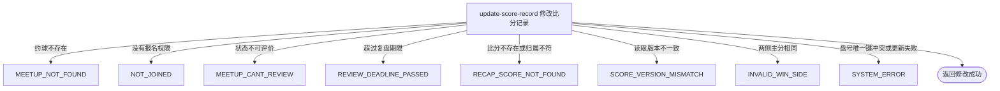

## 概要

在约球复盘窗口内按业务编号和读取版本修正一盘比分。

## 触发

约球发布者或被当前报名查询识别为已报名的登录用户，在约球进行中或结束后的复盘期限内提交一盘比分的整套修正内容时发起。调用方需携带此前读到的版本，但当前实现只做更新前比较，并未形成真正的数据库乐观锁。

## 接口契约

### 请求参数

| 字段 | 类型 | 必填 | 约束 |
|---|---|---|---|
| `meetupId` | 字符串 | 是 | 不可为空白；约球必须存在、可复盘且未超过截止时刻 |
| `bizId` | 字符串 | 是 | 不可为空白；与约球编号共同定位现有比分 |
| `version` | 整数 | 是 | 必须等于读取时的当前值；仅作更新前比较，不进入更新条件 |
| `setNum` | 整数 | 是 | 未校验正数和范围；若与其他盘冲突由数据库唯一键拒绝 |
| `setFormatType` | 枚举 | 是 | `GAME` 或 `TIEBREAK`；不据此校验比分规则 |
| `matchType` | 枚举 | 是 | `SINGLE`、`DOUBLE` 或 `RALLY`；不核对约球类型和阵容结构 |
| `sideAPlayer1` | 字符串 | 是 | 不可为空白；不核实用户存在或参与资格 |
| `sideAPlayer2` | 字符串 | 否 | 空值不会清除数据库中的旧值 |
| `sideBPlayer1` | 字符串 | 是 | 不可为空白；不核实用户存在或参与资格 |
| `sideBPlayer2` | 字符串 | 否 | 空值不会清除数据库中的旧值 |
| `sideAScore` | 整数 | 是 | 必须与 B 侧主分不同；无范围和计分合法性校验 |
| `sideBScore` | 整数 | 是 | 必须与 A 侧主分不同；无范围和计分合法性校验 |
| `sideATiebreakScore` | 整数 | 否 | 不参与胜方计算；空值不会清除旧值 |
| `sideBTiebreakScore` | 整数 | 否 | 不参与胜方计算；空值不会清除旧值 |

### 成功响应

无业务数据；成功表示更新语句已正常执行。接口不返回更新后的版本、受影响数量或比分内容；由于未检查更新行数，也不保证并发期间仍命中目标记录。

## 业务活动

- update-score-record  校验约球操作资格、复盘窗口和读取版本，重建并更新比分记录

## 流程图

## 详细流程

1. 接收约球、比分业务编号、版本及整套新比分字段，识别当前登录用户并读取约球及全部报名。
2. 确认当前用户是发布者，或存在首条状态为 `PENDING`、`JOINED`、`REVIEWED`、`SKIPPED` 的报名；确认约球实际状态为进行中或已结束，且当前时刻不晚于结束时间加复盘期限。
3. 按约球编号和比分业务编号读取现有记录；不存在时拒绝。比较现有版本与提交版本，不一致时拒绝。
4. 不校验修改人是否原记录人或阵容成员，也不校验新盘号唯一性、盘号范围、阵容结构和参与资格、比分范围及抢七组合；只要求两侧主分不相等并据其大小重算胜方。
5. 以原业务编号重建待更新数据，将约球开始时间写为比赛日期、当前用户写为记录人，并用当前可取得的球员档案生成昵称、头像和性别快照。
6. 仓储按约球和业务编号更新所有非空字段；提交空值不能清除已有可选球员、抢七分或资料快照，改成无档案球员时旧快照也可能残留。修改后的盘号与其他记录冲突时由数据库唯一键报错。
7. 提交版本只用于更新前内存比较，未写入更新实体；更新语句不带版本条件也不递增版本。并发请求可同时通过校验并互相覆盖，受影响行数也未检查。
8. 返回成功但无业务数据；不交付修改后版本或内容，也不改变约球、报名、评价和个人评分。

## 异常分支

| 对外失败码 | 触发条件 | 由哪个活动报出 | 补偿动作或超时处理 | 对外提示 |
|---|---|---|---|---|
| 请求校验失败 | 任一必填字段为空；枚举值无法转换 | 流程 | 不读取或修改比分 | 使用对应字段的不能为空提示；无法识别的值按请求或系统异常处理 |
| `MEETUP_NOT_FOUND` | 指定约球不存在 | update-score-record | 不修改比分 | 约球不存在 |
| `NOT_JOINED` | 当前用户不是发布者，且找不到首条 `PENDING`、`JOINED`、`REVIEWED`、`SKIPPED` 报名 | update-score-record | 不修改比分 | 你未报名该约球 |
| `MEETUP_CANT_REVIEW` | 约球实际状态不是 `ONGOING` 或 `FINISHED` | update-score-record | 不修改比分 | 约球不可评价 |
| `REVIEW_DEADLINE_PASSED` | 当前时刻晚于约球结束时间加 `review.deadline_days` | update-score-record | 不修改比分 | 评价已超期 |
| `RECAP_SCORE_NOT_FOUND` | 约球下不存在指定业务编号的比分 | update-score-record | 不修改任何比分 | 比分记录不存在 |
| `SCORE_VERSION_MISMATCH` | 更新前读取到的版本与提交版本不一致 | update-score-record | 不修改比分，调用方应重新查询 | 比分版本不一致，请刷新后重试 |
| `INVALID_WIN_SIDE` | A、B 两侧主分相同 | update-score-record | 不修改比分 | 获胜边无效 |
| `SYSTEM_ERROR` | 修改后的盘号与同场其他记录冲突，球员资料读取、数据库更新或其他未归类操作失败 | update-score-record | 唯一键冲突时单条更新不生效；其他失败需重新查询确认 | 系统异常，请稍后重试 |

两个并发请求可能都用同一版本通过内存比较，之后互相覆盖且版本保持不变。目标记录在读取后被删除时，更新零条也可能返回成功。空值不能清除旧可选字段，属于当前更新语义而非异常。

## 技术线索

- HTTP 接口：`POST /recap/score/update`
- 记录表：`rally_meetup_score`
- 查找与更新条件：`rally_meetup_id = meetupId` 且 `biz_id = bizId`
- 读取版本校验：`existing.version == cmd.version`
- 实际更新实体：`version` 为 `null`，乐观锁插件不追加版本条件、不递增版本
- 字段更新策略：默认只更新非空值，无法用请求空值清除旧字段
- 唯一约束：`uk_meetup_set (rally_meetup_id, set_number)`；修改前不预检新盘号
- 胜方计算：仅比较 `side_a_score` 与 `side_b_score`
- 记录人：每次成功更新为当前用户；比赛日期重新取约球 `start_time`
- 复盘窗口：实际状态为 `ONGOING` 或 `FINISHED`，截止时刻为 `end_time + review.deadline_days`
- 未实现事项：评分重算仅有 `TODO` 注释
