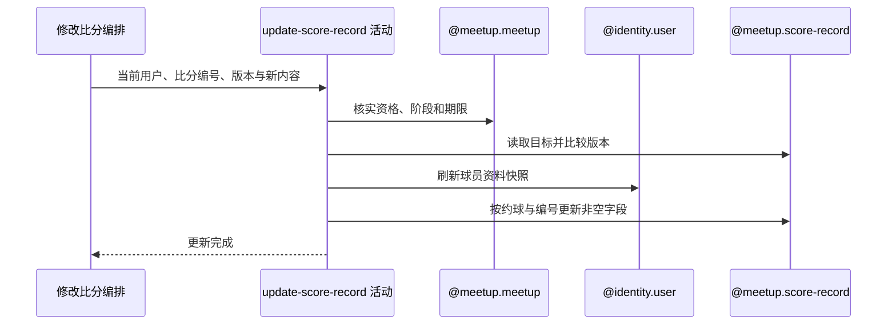

## 概要

校验约球操作资格、复盘窗口和读取版本，重建并更新比分记录。

## 时序图

## 触发条件

已登录用户提交通过必填、枚举和版本非空校验的整套比分修正后执行。

## 活动契约

入参包含 `meetupId`、比分 `bizId`、读取版本及与新增相同的盘号、盘制、比赛类型、阵容和分数字段；成功无业务返回，也不返回新版本。

## 异常分支

| 错误标识 | 触发条件 | 来源 |
|---|---|---|
| `MEETUP_NOT_FOUND` | 约球不存在 | update-score-record 流程对应错误一行 |
| `NOT_JOINED` | 非创建者且无待审核或有效报名 | update-score-record 流程对应错误一行 |
| `MEETUP_CANT_REVIEW` | 实际状态非 ONGOING/FINISHED | update-score-record 流程对应错误一行 |
| `REVIEW_DEADLINE_PASSED` | 超过复盘期限 | update-score-record 流程对应错误一行 |
| `RECAP_SCORE_NOT_FOUND` | 约球下不存在该比分编号 | update-score-record 流程对应错误一行 |
| `SCORE_VERSION_MISMATCH` | 读取版本与请求版本不同 | update-score-record 流程对应错误一行 |
| `INVALID_WIN_SIDE` | 两侧主分相等 | update-score-record 流程对应错误一行 |
| `SYSTEM_ERROR` | 盘号冲突、资料读取或更新失败 | update-score-record 流程 `SYSTEM_ERROR` 一行 |

## 领域依赖

### @meetup.meetup

- 输入：约球、操作人和核实复盘资格、阶段、期限的意图
- 输出：允许时返回约球开始时间；不允许时返回相应失败结论

### @identity.user

- 输入：新阵容非空去重球员与刷新昵称、头像、性别快照的意图
- 输出：返回存在用户资料；缺失用户不阻断且对应新快照为空

### @meetup.score-record

- 输入：约球、比分编号、读取版本、新内容和更新记录的意图
- 输出：存在且读取版本匹配时按非空字段更新；不存在、版本不匹配、平分、盘号冲突或失败时返回相应结论

## 业务动作

A1 核实操作资格与复盘窗口
A2 读取比分并比较请求版本
A3 按新主分重算胜方并刷新球员快照
A4 以原业务编号更新非空字段

## 详细流程

1. `A1` 权限、阶段和截止规则与新增比分相同：发布者或 `PENDING/JOINED/REVIEWED/SKIPPED`，实际 `ONGOING/FINISHED` 且未超期。
2. `A2` 按 `meetupId+bizId` 读取目标，不存在拒绝；仅在内存比较 `existing.version==cmd.version`。
3. 不校验修改人是原记录人/球员，也不预检新盘号、不校验盘号范围、阵容结构/资格、分数范围、网球计分和抢七组合；只拒绝主分相等并按较大值重算胜方。
4. `A3` 用约球开始时间重写比赛日期、当前用户重写 `recordedBy`，批量查询新阵容并生成新资料快照。
5. `A4` 以原 bizId 构建新对象，但没有把请求或读取版本写入对象；更新条件只有 `meetupId+bizId`，版本不在 SQL 条件且不会递增。
6. 默认更新策略只写非空字段，因此请求 null 不能清除旧二号球员、抢七分或快照；新球员资料缺失形成的 null 也可能保留旧球员快照。
7. 修改盘号与其他记录冲突由唯一键报错；目标在读取后被删除时更新零行也可能成功。受影响行数不检查，评分重算仍为 TODO。

## 边界情况

- 两个请求用同一版本可同时通过并互相覆盖，版本保持不变。
- 可选字段无法通过 null 清空，可能形成新用户编号配旧资料快照。
- 新盘号冲突不产生专用业务码。
- 删除与更新并发时可能返回成功但无记录被修改。

## 实现提示

当前不是真正乐观锁；应在聚合仓储使用 `WHERE biz_id=? AND version=?`、原子递增版本并检查影响行数，同时定义可空字段显式清除语义。
